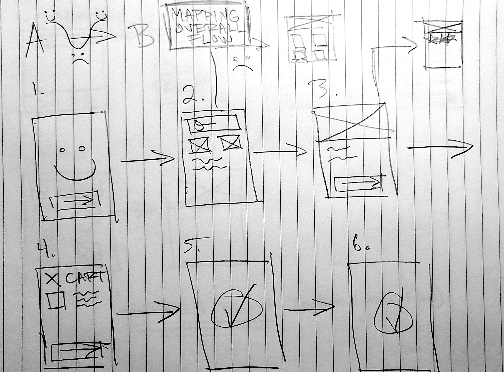
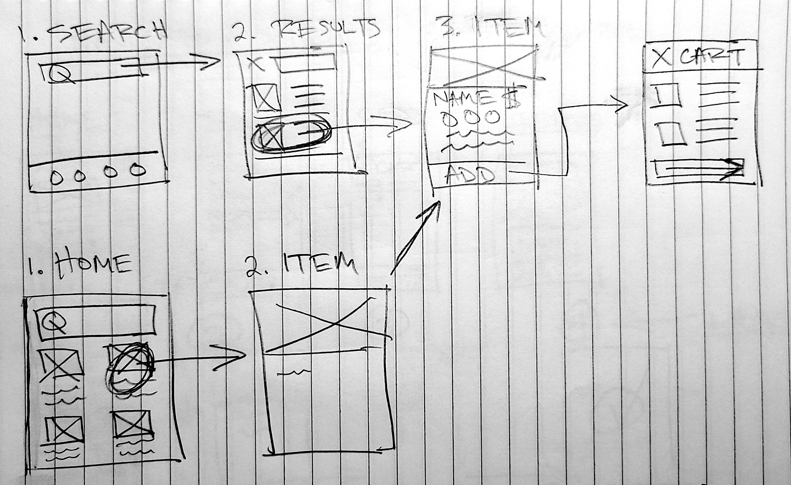
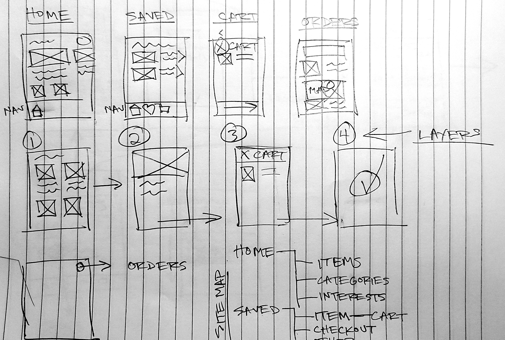
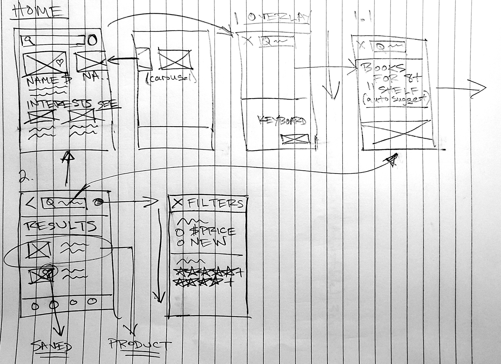

# Section 3 - Sketching

## 1. Be prepared

- Prepare tools beforehand
- What are your goals?
- Who is your audience?
- **Time yourself**

## 2. Ready, Set... Go`!`

- Draw a frame for your device
- Start with more simple & redundant elements
- Move onto more detailed interactions
- Annotate your sketches and keep them safe
- Keep Going
- Share your sketches

## 3. Refinement

- Add titles
- Add annotations... again
- Use numbers
- Use arrows!
- Add gestures (last)

## User Journeys

1. Understand what you need to draw
2. Define some sort of a starting point
3. Decide your next steps

## TIPS

- Don't worry about being messy
- Be lean & agile, sketch quickly
- Refine later
- Use basic shapes
- Keep sketches safe (take photos / scans)
- Be prepared, keep tools with you on hand
- Hang sketches up for notes / inspo
- Communicate / share with team
- Use a whiteboard

(Note to self - get dotted grid paper / iPad)

### Mapping Overall Flow

### Screen Flow (Optional User Flow)

### Navigation Schemes (Structure)

### Screen States (Micro Interactions)

- - -

[back](../README.md)
