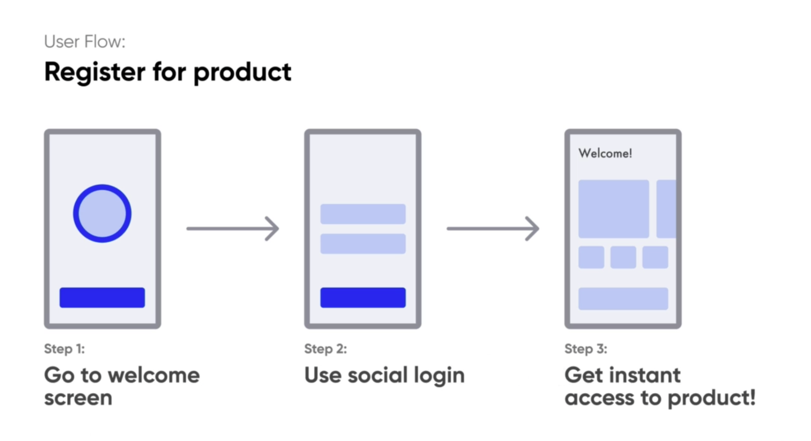
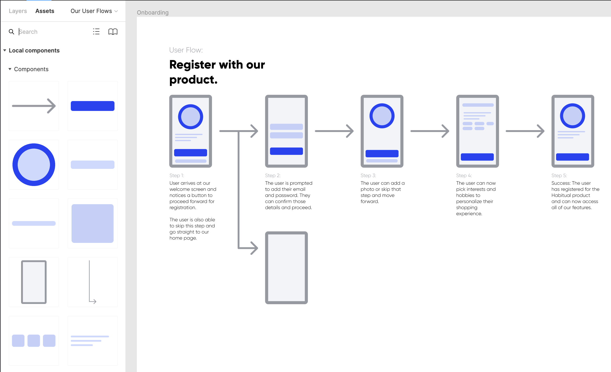
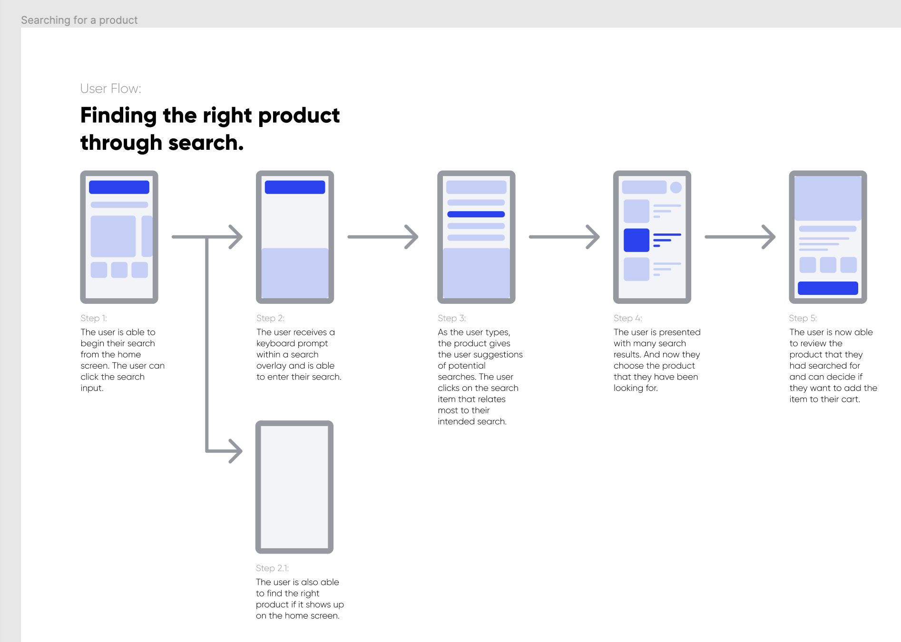
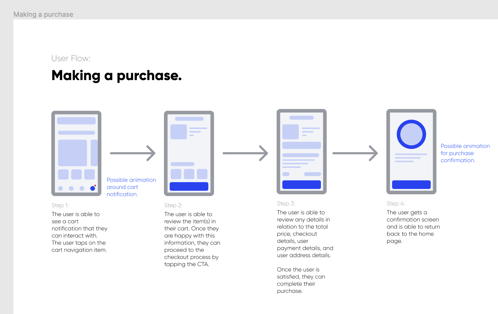

# Section 6 - User Flows

## What is a user flow?

- A series of steps the user takes to achieve a meaningful goal.
- Used to communicate the intended flow of the user through various pages and actions.
- Should include name, steps, users, and a description of what happens at each step.

### What the user sees -> What they do -> (next screen) What they see next -> What the do next

1. What is the goal or purpose? (Title)
    - Who is doing it?
    - How do they do it?
2. User flows go in ONE direction, despite popular belief.  
3. Describe each of your steps
    - Represent a complete task
    - Be concise

User flows should be the most clear model of your product.

## DOs and DON'Ts

- DON'T be vague
- DO use descriptive names
  - Make as many separate flows as necessary
- DON'T create flow maps
- DO create distinct flows that move in a single direction
  - Keep it simple
- DON'T leave out details
- DO add the right amount of detail
  - Outline each step and goal
  - Eliminate confusion

## Speed Up Workflow with Components

- - -

[back](../README.md)
