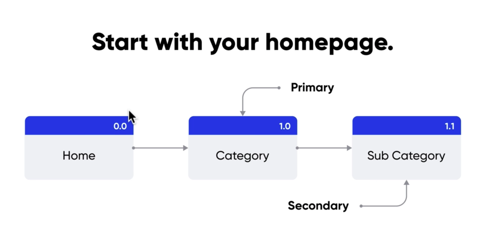
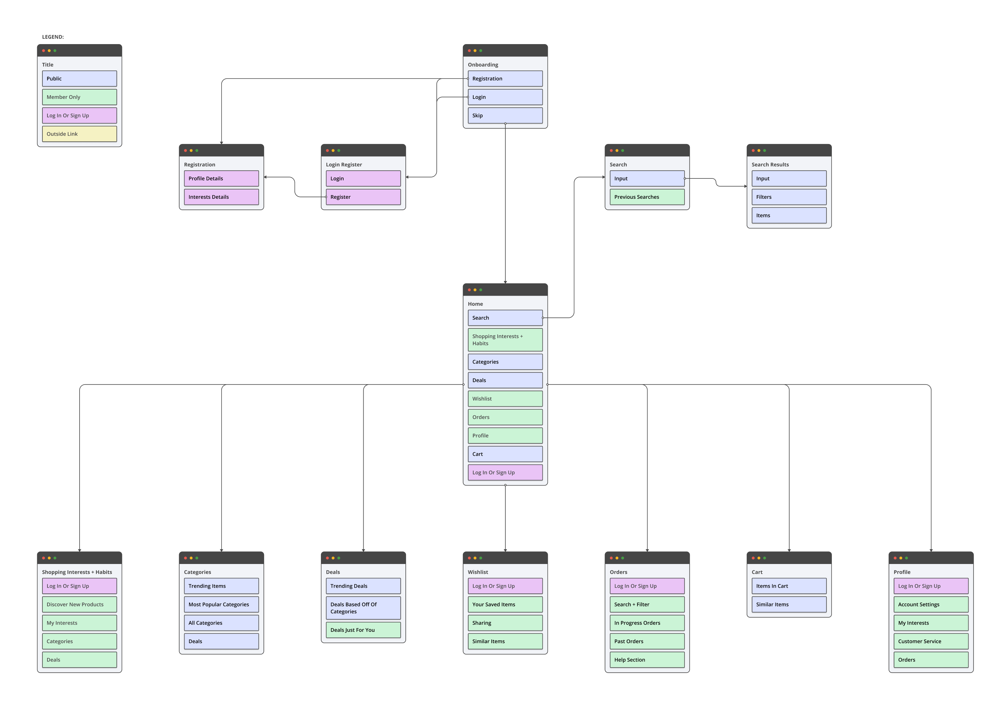

# Section 7 - Sitemaps

Sitemaps are hierarchical diagrams that show how pages are organized and prioritized.

- They help provide structure for your product
- User flows are a street view
- Sitemaps are a bird's eye view
  - An early glance of what a product looks like

## When to use sitemaps

- In the beginning or early on in the design process after gathering a client's information on the product
- Prior to wireframing

## Anatomy of a Sitemap

- Reference number and label for each card
- Starts with "Home" page (ground zero)
- Built left to right or top to bottom

You may also use a legend with color coding if it helps

### 2 types of sitemaps

- Flat - small to medium size (10-100 pages or less)
  - 4 or less vertical levels
- Deep - for housing a lot of information (100s of pages, e.g. govt or ecommerce sites)
  - 5+ levels deep

## Why are sitemaps valuable?

- They help you plan for usability
- Provide a full overview to help teams simplify and trim unnecessary pages
- Can help strategically place content where users can find it
  - Resulting in the creation of your navigation, hierarchies, and categorizations of your product
- Can calculate amount of content you need
- Gives good understanding of scope

## Tips for Getting Started

- Do not worry about new user flows
- Focus on one thing at a time to make more thoughtful decisions
  - Basic hierarchy
- Go off of existing user flows / sketches
- After initial sketches, move everything over to one online tool (Figma, etc.) for revisions
- Use colors to distinguish different elements and features (legend)
- Do not aim for perfection
  - Be lean and agile

### Sitemap Exercise:

- - -

[back](../README.md)
