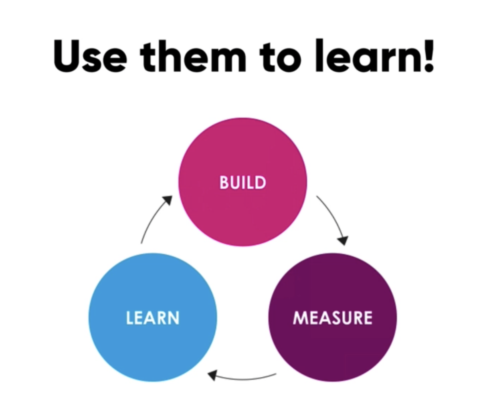
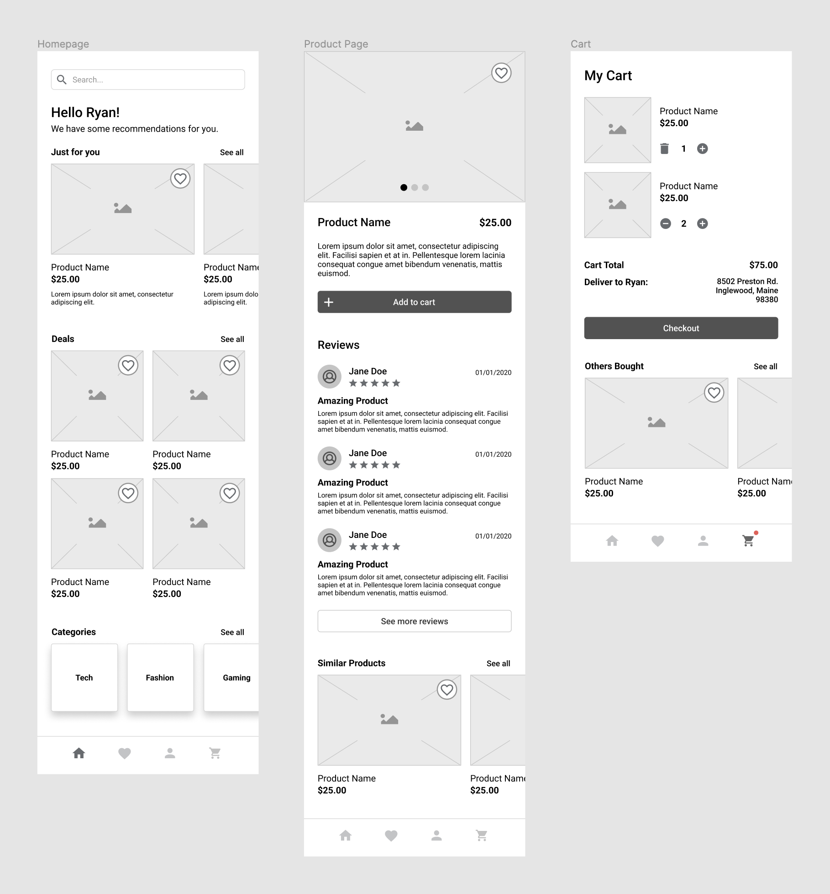
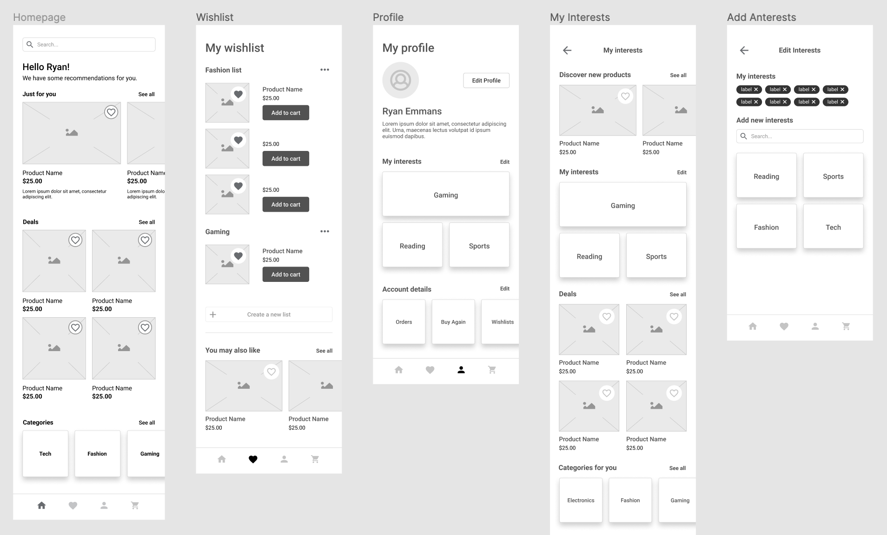
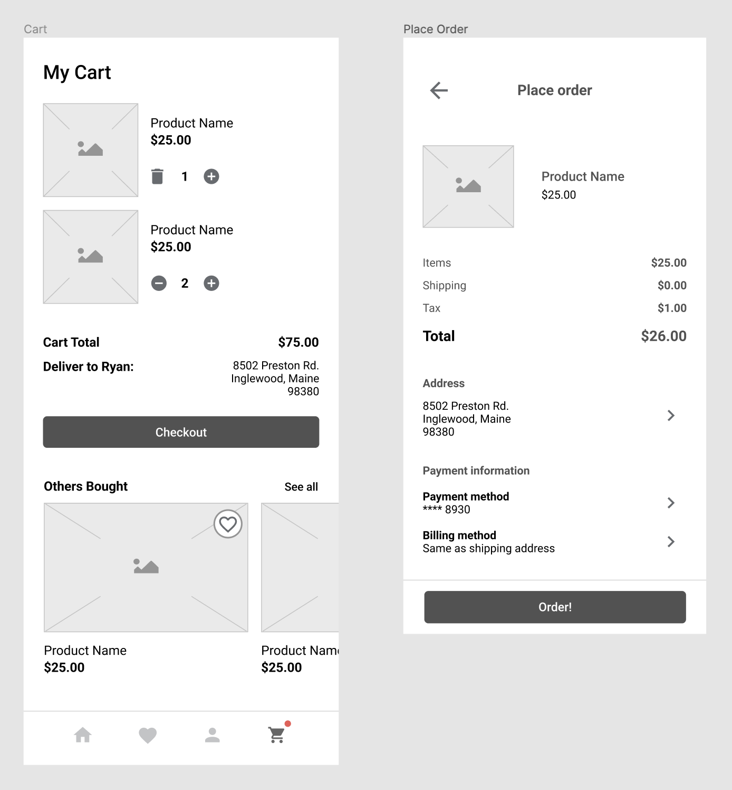
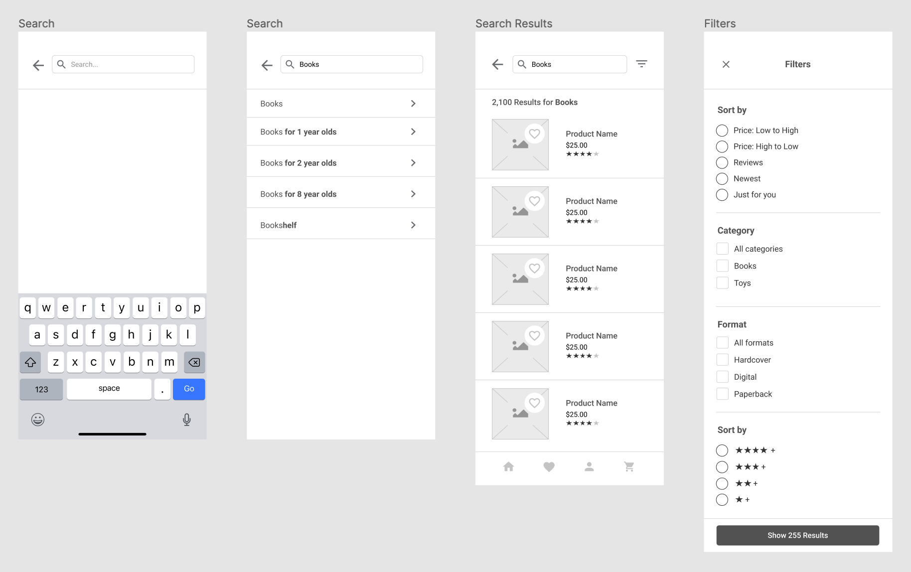
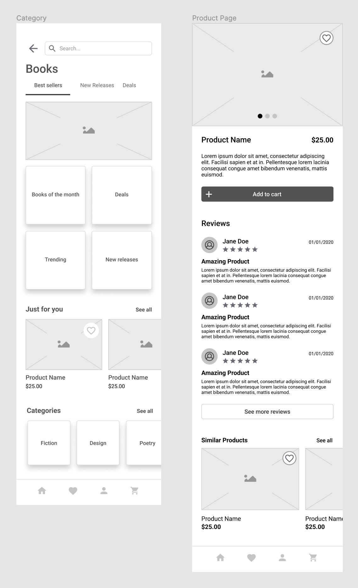

# Section 9 - Wireframes

A wireframe is a low fidelity layout that serves 3 simple purposes:

1. Presents information that will be displayed on page in more detail
2. Gives an outline of page structure and layout
3. Conveys overall direction and discription of UI

It is a detailed and specific blueprint of your product, providing a clear overview.

- Middleground between sketches and prototypes
- Plan layout and interaction patterns
- Heavily influenced by user stories, user flows, sitemaps, etc.
  - Consult previous artifacts to create wireframes

## WHY do we use them?

- Help to test concepts and structure
  - To understand how users will navigate your product
  - Similar to user flows, in much more detail
    - Different types of interactions
- ***To learn***
  - Fast, cheap, and impermanent
  - Meant to change as more research and feedback is gathered from clients and users
  - A great place to fail!
    - Test assumptions as early as possible before creating high fidelity designs

- The design process is iterative, not linear.

## HOW to *use* wireframes

### Useful for 3 big reasons

1. Help a team estimate *type* of work they will complete
    - Clarity and common understanding across team
    - What will be built
    - Wireframes are collaborative
2. User testing
    - Uncovers pain points and opportunities
    - Customer journey maps
3. Demo to clients/stakeholders for feedback
    - Interactions, flows, placement, layout, heirarchy
    - Changes to high fidelity designs is more time-intensive
      - The earlier the better when making changes

### **Test early and often!**

- Do not yet worry about unnecessary details such as color, typography, etc.

- - -

## How to *create* wireframes

### **Keep It Simple**

- Do not concern yourself with fidelity when wireframing
- Get people to understand what you're trying to convey
- Pencil and paper is best for speed
- Can be polished up to showcase for clients
  - Grayscale, 2 fonts max
  - Can show hierarchy with bolding fonts / size

### Ask important questions

- What are the goals of the user and the business when interacting?
- How can content be organized?
- What should the user see first?
- What is the user *expecting* to see in certain areas?

### Consult user flows and sitemap / story map

- Key requirements and hierarchies
  - Most and least important elements
- Discuss risky features to prioritize workflow
  - Tackle riskiest features first

### Bring team into the process (!important!)

- Gather insights
  - Business goals, technical challenges
  - Understand what can and cannot be built in regard to time and money
    - Reaching MVP and then building in later releases

- - -
### Initial Wireframe Exercise:

#### Additional Wireframes:

- - -

[back](../README.md)
