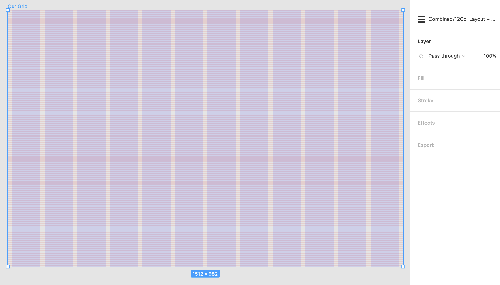

# Section 13 - Spacing & The Grid

## What Is A Grid?

- A structure comprising of a series of lines that divide a page into columns and rows
- Helps designers arrange content on the page
  - Serves as a layout skeleton, originally came from print design

### History

- Linked to typography and manuscript layout
- The Renaissance era had a profound impact on grid systems
  - Artists strived for perfect geometry
  - Many paintings strived for centered symmetry
- 13th century - diagram for harmonious design
  - Merger between grid system and golden ratio
  - Created to produce page layouts with margins of fixed ratios

- Industrial Revolution - beginning of mass production
  - Rise of newspapers / posters
  - Designers needed to develop a way to communicate their message to allow for natural reading behavior
- Modern grid - tied to Swiss design
  - White space was first used in layout design
  - A heavy influence on layout

## Grid Basics

### Base Units

Define what every single measurement will be a multiple of

- Why use base units?
  - Makes designs consistent
  - Improves developer handoff
  - Reduces number of design decisions

- 8px base unit makes device scaling easy

### Sizing

All UI elements should be measured in increments of base unit

- Helps with clear alignment, consistency, and hierarchy

### Padding

Spacing between all elements, should be based off of base unit.

- Makes spacing consistent and readable to users

### Layout

- LINES and BOXES

Anatomy of a Grid

1. Columns
    - Vertical blocks that span from left to right
      - Column width generally will not change
      - Number of columns will change from 12 `(desktop)` to 8 `(tablet)` to 4, 6, or 8 `(mobile)`
        - Personal preference
2. Gutters
    - White space between columns
    - Dedicated based off base units
      - Some designs will increase or decrease as you scale up or down
3. Margins
    - White space between edge of column and edge of frame

All elements can be combined to build different types of grids

- Manuscript Grid - useful for defining margins and LARGE blocks of text
- Column Grid - most popular and common
  - Typically utilize 12 columns - Divisible by 2, 3, 4, and 6
  - Aids in designing for responsive screens

- Modular Grid - variation of column grid, but with the addition rows
  - Creates modules that provide additional layout options
- Baseline Grid - !important! - can be *coupled with* column grid
  - Consists of horizontal rows
    - Provide guidance for typography and UI elements
    - Create vertical rhythm
    - Based off base unit (4px is recommended)
    - Line Height is used for placing typography
      - Bounding box around type

## Responsive Grids And Breakpoints

Fixed vs Fluid:

Responsive w/ Breakpoints

## Making Our Grid in Figma

## Grid Guidelines

- Items should never be left in the gutters!
  - Adhere to your grid
- It helps to create grids inside of grids (Parent and child containers)
  - These grids should also be consistent across UI elements

- Outside column is not for padding!
- Full Bleed Elements
  - Should stretch to edge of artboard (think background image)
  - Content/elements within still adhere to grid

- - -

[back](../README.md)
