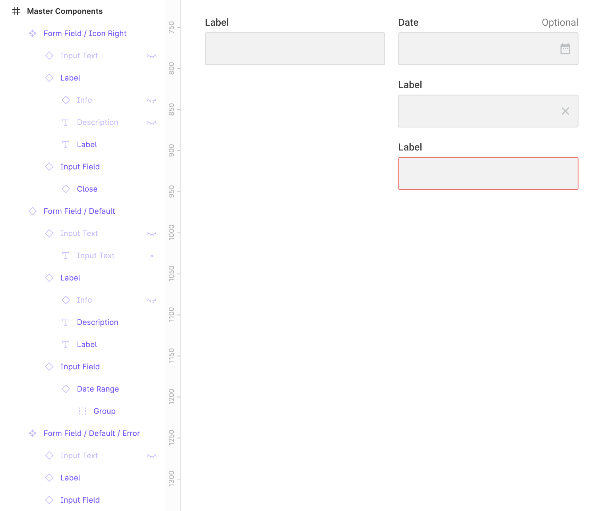

# Section 16 - Forms & UI Elements

## What are Forms & UI Elements?

Elements within a user interface

- Cards, icons, navigation, badges, pickers, etc.
- Forms are most common, probably most important
  - Forms are everywhere
  - Consist of inputs, buttons, etc.

***Forms are crucial to the success of the product you are designing for.***

### Where to Start

- PLAN, beginning with sitemap
- Know what type of content you are dealing with
  - Ex: search, registration
- Before even building a form - What questions do you want to ask the user?
  - Quick prototyping, testing, iteration
  - Generate ideas, revisit, and refine

## Best Practices for Forms

Forms should feel like a friendly conversation between the user and the product.

- When creating forms, they should be kept as short as possible
  - Only ask absolutely necessary questions
  - Asterisks muddy a design

- Conversations should have a logical flow
  - You would not typically ask for sensitive information first

- Longer forms should be broken up into digestible groups

- Because we read top to bottom, left to right, columns should remain consistent as to not be confusing

- Users also tend to think of right as the *next* step and left as going *back* or the *previous* step.
  - This depends on the context of the situation
- Use secondary buttons whenever possible to prevent users from making mistakes

- Sometimes long forms will need to be split into entirely different pages
  - Long forms will be treated differently on mobile vs desktop

## Best Practices for Inputs

Inputs are the most complex UI elements due to their versatility, different states, and frequent use

### Part 1

- Text Field - single line, most common
- Text Area - for longer responses (multiple lines)
- Dropdown Menus - select menus, best for 5 or more predefined options
- Check boxes - used for one or ***multiple*** selections, best for 4 or less options
- Radio buttons - multiple options, but can ONLY select ONE, again best for 4 or less options

#### Advanced Inputs

- Multi-select text field - add multiple inputs, displayed as chips
  - Users can typically add and remove chips

- Dropdown search - available matching options appear as user types

### Part 2

- Height of input should always be same height as primary button
  - Maintains visual consistency
- All input fields in a form should be the same length (as a guideline)
  - This depends on the information we are asking of the user
  - Example of an exception:

- Nudge spacing should be based off of base unit (4px) - use `option` + `shift` + `arrow` to nudge
- **Labels** should be short and sweet!
  - Clear, easy to read, 1 to 2 words
  - Contrast from input font (bold, shrink, sometimes lower opacity) - hierarchy
  - Only first letter capitalized for easy scanning / readability

- Placeholders can show repetitive information
  - Can also hide important information and reduce accessibility
  - Can be problematic if used as labels or hints
  - Harder to see due to lower contrast, often undetected by page readers
  - Hint text can be used on right side of label instead (date formats, number inputs, etc.)

### Part 3

- Icons inside an input serve no purpose other than to reinforce a form label / what is asked of a user
  - Typically to the left of input text
  - Sometimes help for accessibility reasons
- **Actionable** icons - to the right of input text
  - Chevron for dropdown, show/hide for passwords, clear field etc.
  - These can be clicked on
- Feedback - typically shown for successful / error actions
  - Often used in addition to color - very important for accessibility for colorblind users

### Part 4

Different states tell the user what is currently happening and what should happen next

- Differentiated with text, color, borders
- Visual cues are integral to a good input

Types of input states:

- Default state - empty field, no interaction yet
- Active field - user has clicked - highlighted border (outline) and cursor to signify user can type
- Filled input - all information entered, clicked away from field
- Disabled - due to requirement restriction, generally filled in / grayed out, cannot be interacted with, sometimes information cannot yet be edited
- Success state - when an answer/input is correct or valid, uses green color with outline, icon, and bold text
- Error state - when an answer/input is incorrect or missed, uses red color with outline, icon, and bold text
  - Error message should ***always*** be inline to / directly underneath input

Assistance - sometimes users will need tips or hints to easily complete forms more quickly

- Hint text - right aligned, next to input label, or below input, as opposed to placeholder
- Auto format - user's answer will be automatically formatted depending on scenario (ex: credit card #, phone #)
  - Helps users read and review answers
- Auto complete - saves user time and reduces errors
  - Used for longer fields, helps with formatting and spelling
  - Wide variety of use cases, reduces user confusion
- Default values - prefill text fields with most likely answer
  - Such as country, so users don't need to scroll through or enter manually
  - Typically displayed as drop-down

## Best Practices for Buttons

Important for any UI, not just within forms

- They should describe the action you want the user to take
  - Emphasize value of completing a certain action - keep users motivated
  - Remind user of benefits of completing this flow
- First person words have higher conversion rates - "Create *my* account"
  - Makes the experience personable and even more descriptive
- Make use of primary and secondary buttons to make them easily distinguishable
  - Expected path should be more prominent
  - Mobile - buttons should be easily tapable with bigger area - 40-48px - uses 8px base unit
- Depending on use case, a reset / clear all button can result in data loss, frustration, abandonment
- Disabled buttons - good for cases where a user cannot progress until all required fields are completed
  - Background and text will be grayed out

## Using Atomic Elements

- Creating components within components
  - AKA Inception
  - Ex: labels inside inputs
- Building components with atomic elements gives you so much more control over larger and more complex components

## Using Instances in Figma

It is easy to override an instance of a master component

- You can hide an element in a compoent and make it visible / change it in a separate instance

## Editing Instances

- Themed instances, or variants, make it possible to create different *new* components based off changes you've made to an instance
  - A way to manage component states and variations
  - This is extremely valuable for working efficiently

More practice with editing instances and creating components:

## Responsive Components

- Use constraints especially when designing for responsive websites
  - Labels and icons should stick according to their alignment with an input
  - It saves time to use constraints for components as opposed to instances.

## Creating a Registration Form in Figma

- - -

[back](../README.md)
