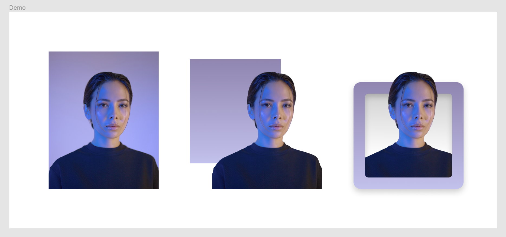
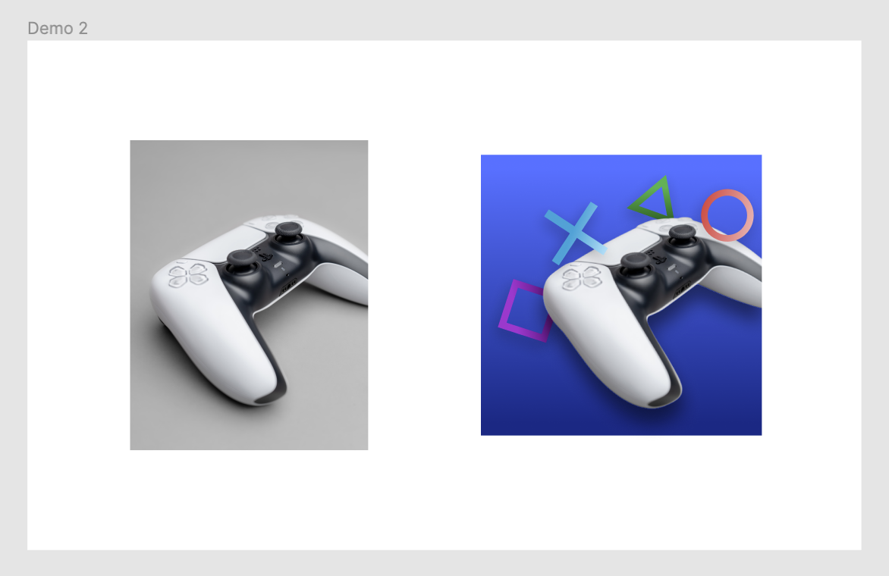
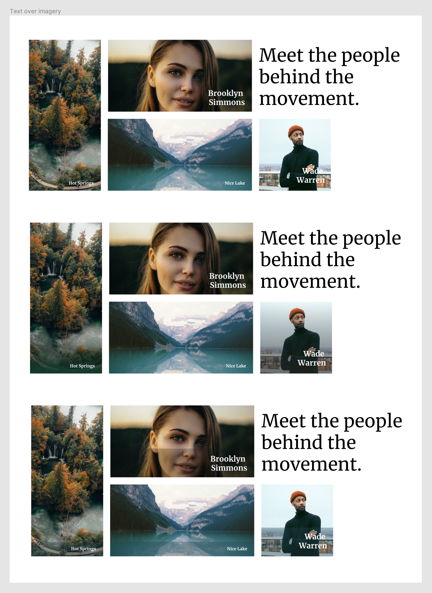

# Section 17 - Visual Assets

## Introduction

Visual assets will play a role in every single project - imagery, illustrations, iconography

- Oftentimes clients will bring you their own visual assets
  - Sometimes they are BAD
    - Budgets are tight and timelines move quick
    - Stock photos are horrible, don't ever use them
    - Sit down with client and/or product team and discuss ways you can improve this
    - IF budget and time allow, hire a good photographer or illustrator. It makes a world of difference.
  - Sometimes you get lucky with good photography or illustration

### Photography:

- Unsplash is an excellent / free resource, there is also a Figma plugin

### Illustrations:

- Figma plugins such as Blush (paid), Illustrations, Humaaans (piece together)

### Icons:

- Material Icons - easy to use
- Figma Plugins - Iconify, Material

## Working With Photos

## Working With Illustrations

## Figma Plugins and Icons

## Custom Icons

- - -

[back](../README.md)
