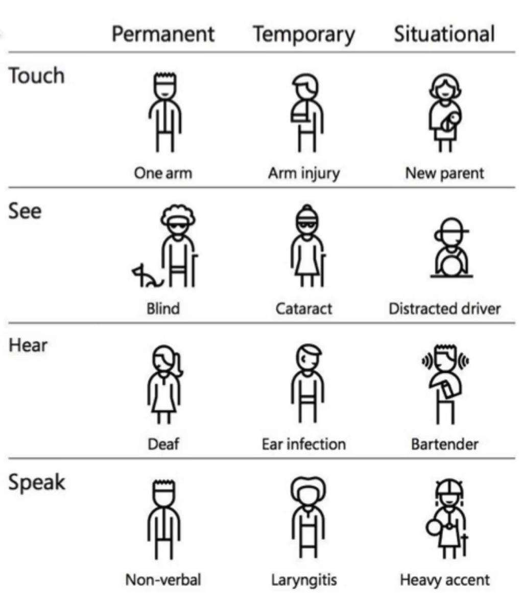
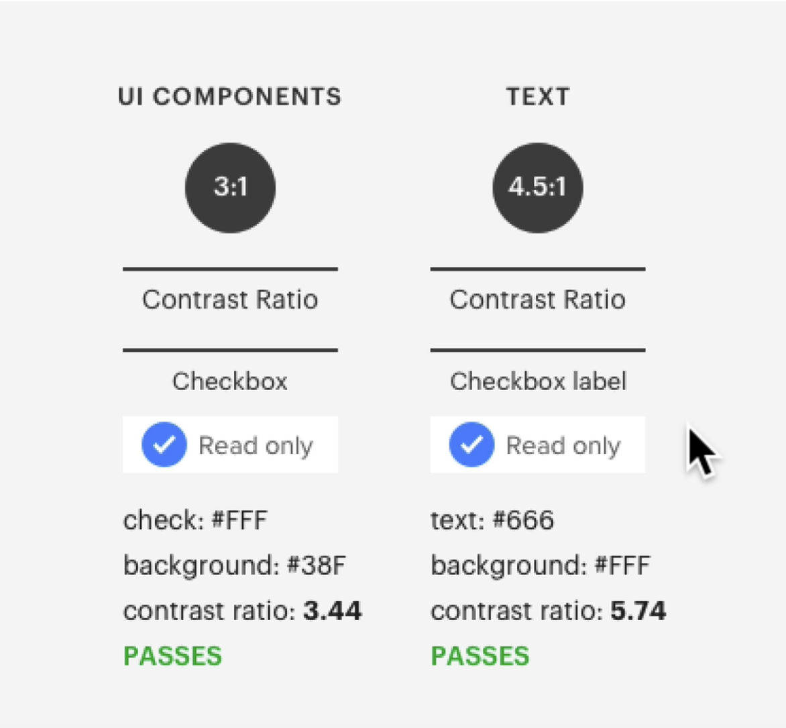
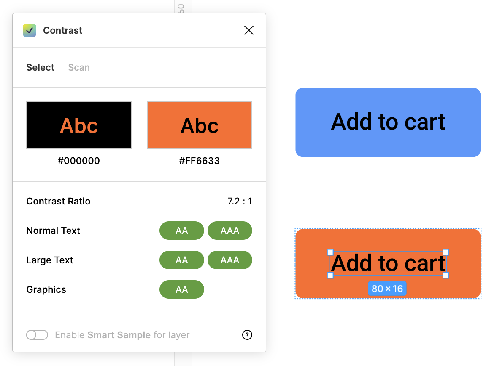
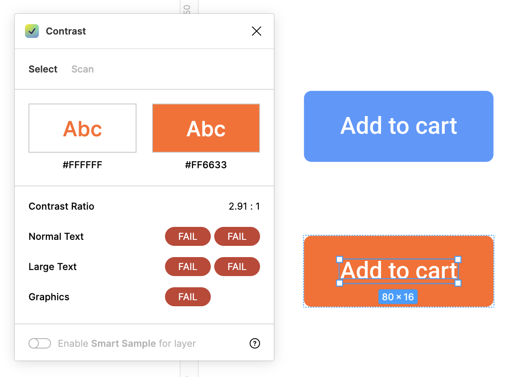
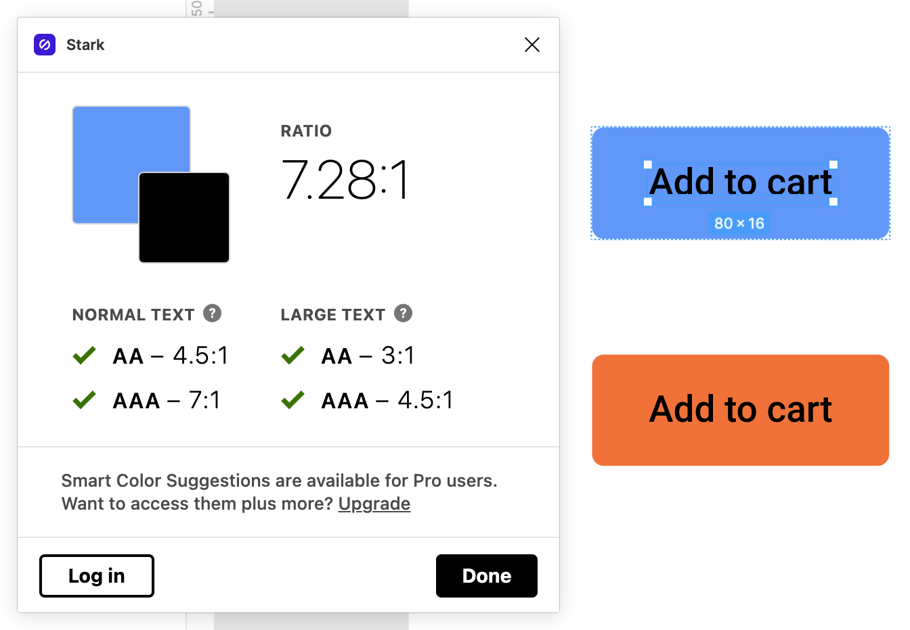
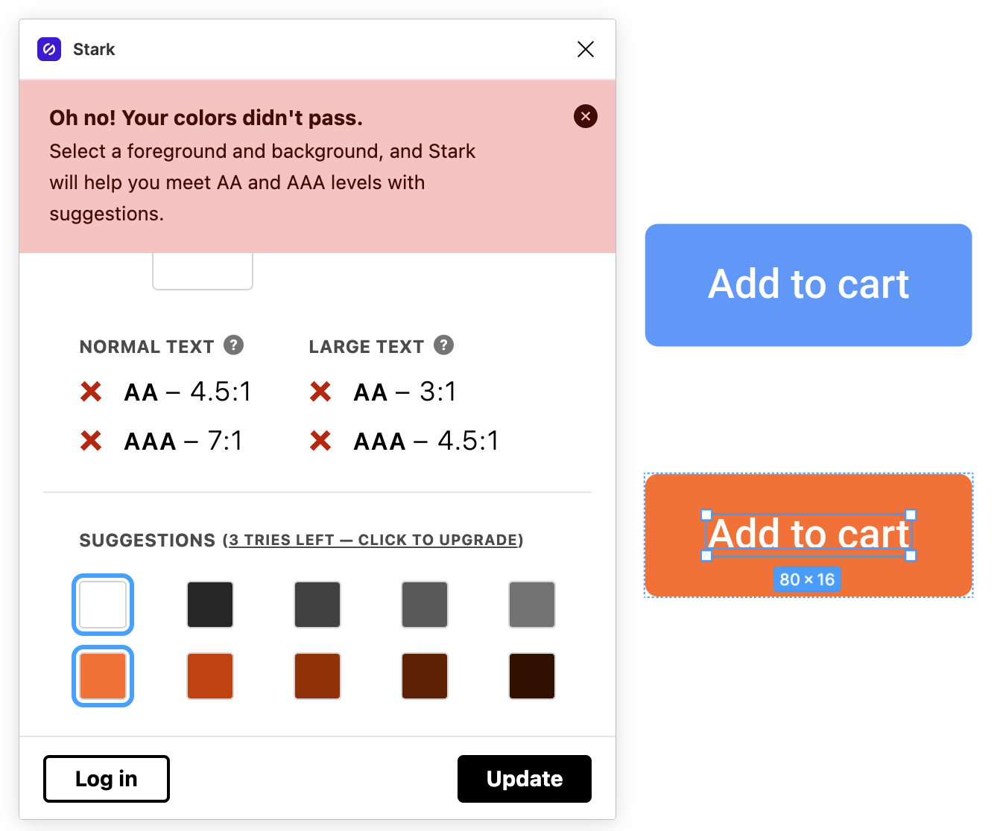

# Section 18 - Accessibility

## What is Accessibility

- We live in an incredibly diverse world.
  - We cannot assume that all users will experience our products in the same way.
  - If one person can't use your product, you have failed them.
  - We usually only account for the majority of users

### Accessible design creates a better experience for everyone

Accessibility should be ingrained in the way we design

- It is not a checklist.
- We should be designing for *all* people

## Assistive Technologies

- Screen Readers - helps the visually impaired understand content displayed on a webpage
- Braille Terminals - for the visually impaired to interact with applications
- Screen magnification software - all elements of a design should be scalable
- Alternate input devices & software

## Visual Patterns for Accessibility

1. Color Contrast - first step toward accessible UI
    - Helps those with visual impairment see certain information on the screen
    - Color Safe : displays current & goal contrast ratios

Readability difference between foreground and background colors

- Larger font size: 18+px bold, 24+px regular
- Small text: less than 18px

Color Safe - choose colors and check contrast ratios before creating a palette.

Colorable - good for checking existing color systems for compliant standards

Color Contrast Analyzer - Chrome extension - identifies areas on screen that need attention

### Labels

- These can go a long way especially in regard to screen readers
  - Labels on top as a separate element as opposed to a placeholder
- Menu labels
  - A menu icon (hamburger icon) on its own is not accessible
  - Without a visible label, they must be properly coded to be accessible

## Tools to Make Your Design Accessible

Color Safe

- We typically aim for AA standards
  - More info at w3.org

Colorable - best for experimenting with finding colors

### Figma Plugins

- Contrast
  - White text on a colored button may be more readable, yet may not meet certain contrast standards
  - Such cases will come down to user testing

- Stark - select layers -> Check contrast

## Visual Patterns Part 2

### Focus States

One of the most important features that enables users to use a computer with only a keyboard

- `:focus { outline: 0 };`
  - This piece of CSS code will cause major accessibility failure
    - **Do not do this!**
    - Focus styles and highlighting help keyboard users know what elements they are interacting with
- Focus outline should also adhere to constrast standards
- Off screen content (ex: hamburger menus, modals, etc.)
  - Tabbing through focus points can oftentimes be off screen and cause users to lose track
    - This can be addressed on the dev side (CSS, JavaScript)
- **Modals** can be an accessibility nightmare when not done properly
  - Tabbing through focus points should only be done in a modal when it is open, never behind the modal
- **Hover States** - should behave the same as focus states if you plan to hide content or an action beneath it.

### Click Targets

- **Cards** - important for accessibility given complexity and numerous state changes
  - Not every single UI element on a screen needs to be focusable
    - Only actionable items need to be focused
- **Target areas** - need to be large enough for users to select on a page
  - Some users with motor impairments may have difficulty selecting smaller items

### We set out to build products that everyone can enjoy and use easily

- Accessibility should be part of the design process from the early stages
- Every element and design pattern should be made accessible
- Always collaborate with your development team

- - -

[back](../README.md)
