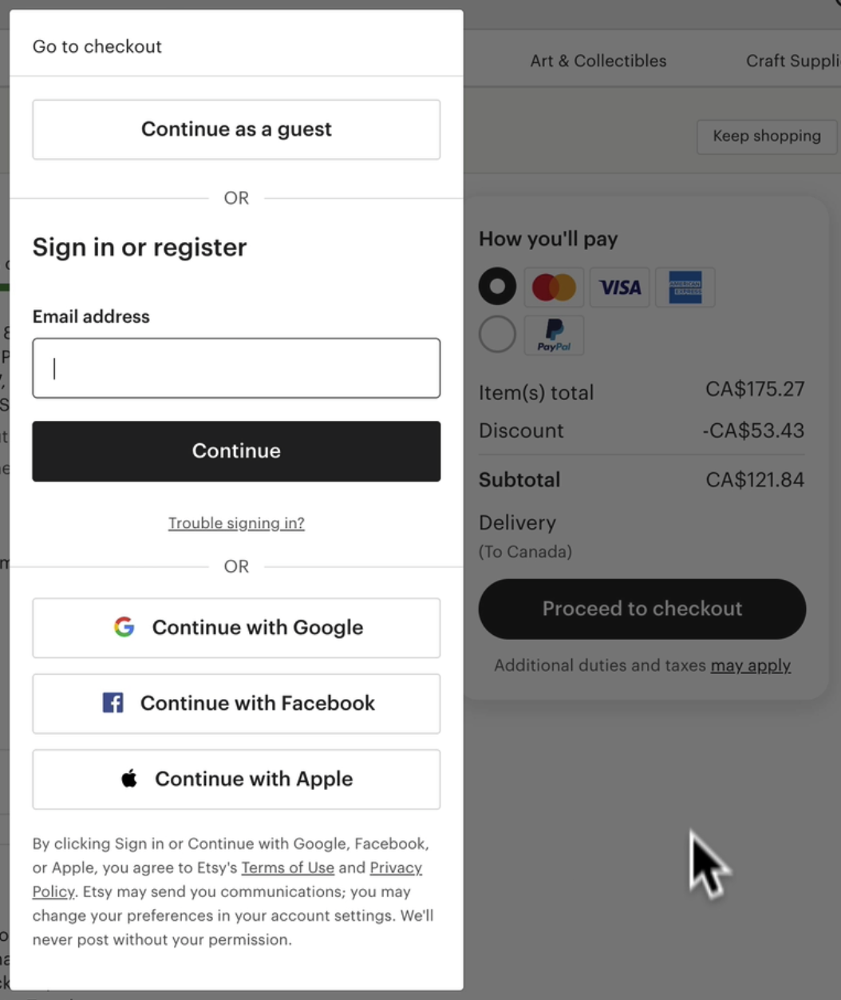
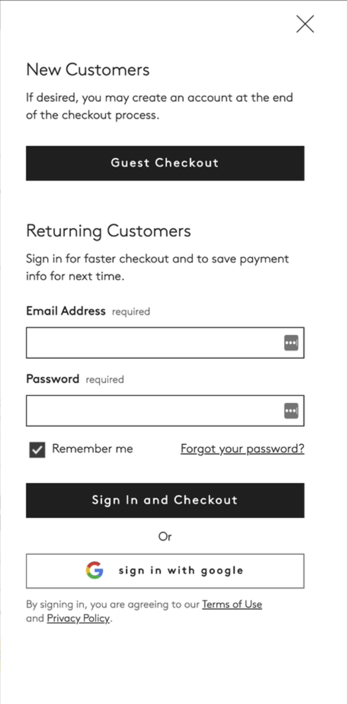

# Section 20 - Design Patterns

## What Are Design Patterns?

- Design patterns are the recurring solutions that solve common design problems.
  - Standard reference points for a designer
  - Infinite scrolls, breadcrumbs, etc.
- When designing a new product - figure out easiest way for users to interact with it.
  - Entering same info repeatedly is tiresome
    - Solutions (or design patterns) for a login: Social media login, "remember me", etc.

### Analyze the problem

- Find ways to eliminate that pain point (possible solutions)
  - We could design our own solution, but chances are several useful solutions already exist and have proven to be effective

### Categories of Design Patterns

1. Data & Input
    - e.g.: drag and drop
2. Content Structuring
    - Streamline flow of user experience
    - Ensure accessibility of all page elements
3. Navigation
    - Should be effortless
4. Incentivisation
    - Push users to perform actions with rewards
5. Hierarchy
    - Craft visual hierarchy to easily distinguish primary elements
    - Secondary and tertiary should also be clear
6. Social Media
    - Encourage users to share and interact with others
    - Links, buttons, tags, etc.

## Why Are Design Patterns Valuable?

They solve problems!

### People will naturally look for patterns

- When we arrive on a web or mobile site, we often think we already know where to click
  - Based off prior experiences with other applications
  - Users have an easier time accomplishing their goals when sites incorporate *known* patterns
  - Most designers will agree there are significant benefits when following established patterns
- Standard design patterns reduce cognitive strain!
  - They prevent us from having to constantly reinvent the wheel

## How to Apply Design Patterns

1. Figure out the problems that require solutions
2. Analyze other (similar) products that have found a solution
3. Examine how other products *implement* these solutions
4. Analyze each pattern and decide which one is right for your problem (Narrow it down)

Detect usability issues within your interface with *real data*, not assumptions

## Analyzing Design Patterns

How to address site abandonment during checkout

- Amazon - requires creating an account / signin wall
  - Name, email, password
- Ebay - sign in to check out, or check out as guest
  - PayPal as payment option
- Etsy - "Add to basket" takes you straight to basket with payment options (including PayPal)
  - Continue as guest, sign in / register, OR social login with Google, Facebook, Apple

Social login requires least amount of work for user to successfully complete checkout process

## Dissecting and Choosing Design Patterns

### Etsy

- 'Add to basket' pushes you straight to checkout ('keep shopping' button easy to miss)
- Primary action - continue as guest
- Sign in field is already in focus
- Social login is third option
- Strong design pattern

### CB2

- 'Add to cart' prompts 'Continue shopping' or ' Checkout now' as modal from top
  - Allows user to keep scroll position on page
- Cart - Add promo code, Checkout now, or checkout with PayPal
  - 'Checkout now' opens sidebar
    - Guest checkout
      - Broken up into 3 step process
    - Returning customers sign in
    - Or sign in with Google (only social option)

Dissecting patterns consists of analyzing very similar options, in this case a social login for ecommerce.

- Find the pattern that is the best for your needs
- Adopting best methods/patterns from multiple options can be combined to implement the best solutions.

- - -

[back](../README.md)
