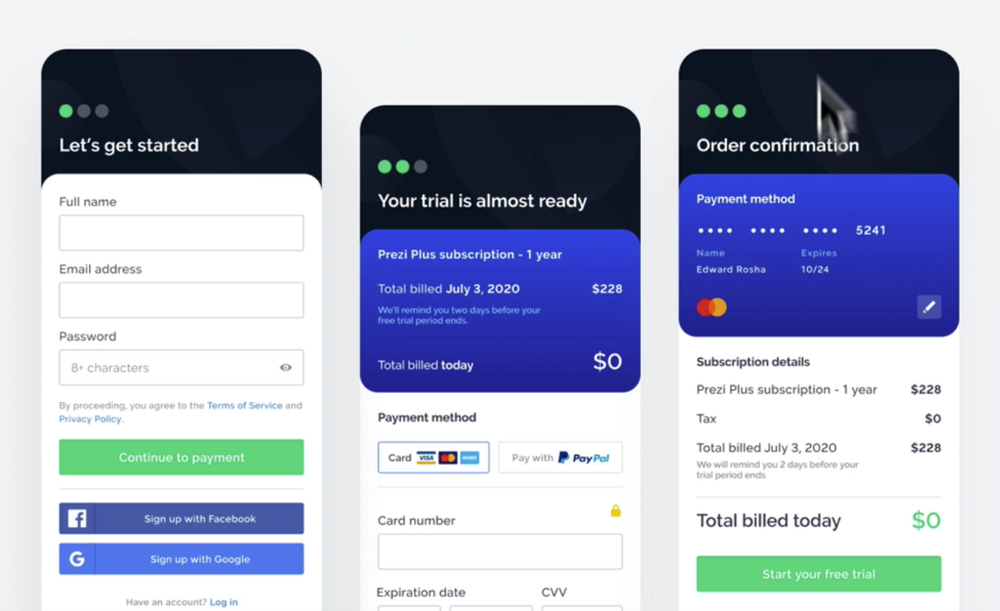
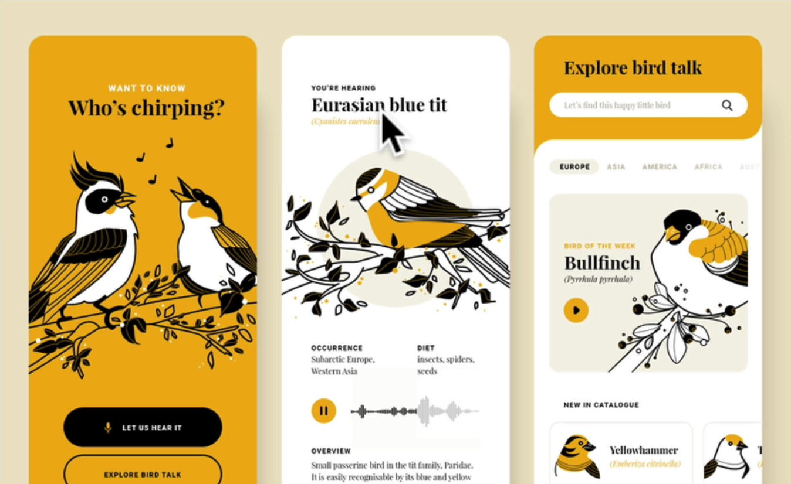
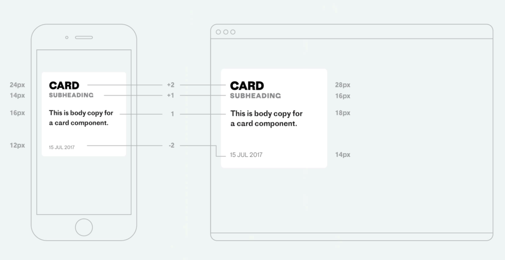
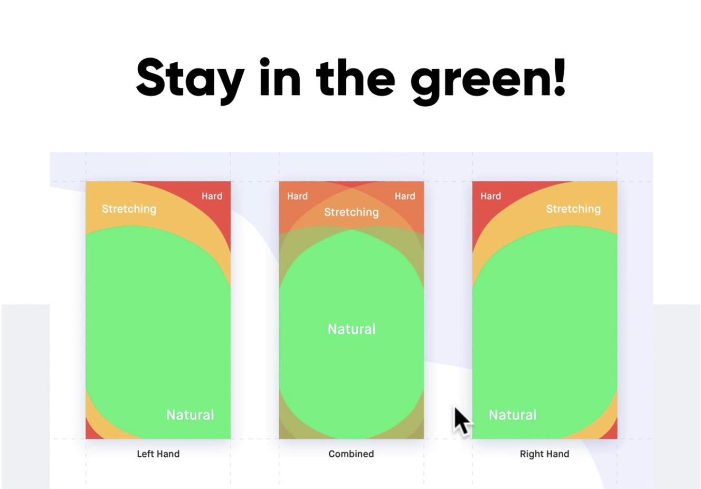

# Section 21 - Mobile Design

Mobile design is so important especially when building responsive products or mobile specific products

- The difference between a good and bad app is the quality of its user experience
  - Designing good mobile experiences has never been more important, as phones have replaced computers for many uses.
  - Mobile users have high expectations
    - Delight, speed, ease of use

## Best Practices Part 1

### Don't make users think

- If app is too hard to use or understand, you risk users walking away from product
- DECLUTTER - screen real estate is minimized
  - Practice hiding elements under interactions

### Break tasks into smaller chunks

- Flows with logically connected steps make everything easy for users

### Stick to patterns that are proven

- Reuse elements and screens that users are used to - home screen, settings, products, etc.

### Minimize user input

- No long forms, break up into steps
- Remove unneccessary fields
- Preformat fields (phones #s, credit cards), auto complete (addresses)
- Validate inputs dynamically

### Consistency - Fundamental principal of design

- Typeface, buttons, labels, color, etc.
- Functional, interaction

### Give your user control

- Illusion of control - understanding where things are going, how things work
- Overall predictability
  - Familiar patterns with interactive elements - feeling of control
    - Cards tell us we can tap them, icons for menus, etc.

## Best Practices Part 2

- Make your product easy to navigate!
  - Biggest priority of any app
  - Users should be able to browse a product effortlessly while completing their tasks
- Think about standard navigation patterns
  - Bottom bar, drawer, sidebar, etc.
  - Users are already familiar with these patterns
- Think about order
  - Prioritize different types of product options
- Stay consistent (Again!)
  - Stick to one pattern and one only
- Animations and microinteractions
  - Should not be an afterthought
    - Consider from beginning of design process
  - State transitions
    - Instantaneous changes would be confusing and jarring for a user
  - Stick to the basics - pull, tap, slide, etc.
    - Anything else will require a steep learning curve
- Think about first time experience
  - Can make or break a user's understanding / feeling about an app
- Try letting users use the app first without signing in
  - Mandatory registration is a common source of friction and abandonment
  - Only sign up if it's essential, or delay registration until the end
  - Trial gives more incentive to sign up later
- Onboarding is *so important*
  - App should showcase why users should stay
    - Ease of use
    - Illusion of fast product (loading / skeleton screens, nothing blank or static)
- Remember, this is mobile, not desktop!
  - Optimize for smaller screen size
  - Should be readable and legible
    - < 14px will be hard to read on mobile
    - Font family, contrast, limit characters per line

- Design for fingers, NOT cursors
  - larger buttons, cards
  - Making touch areas easily accessible
  - Space *between* elements 
- Keep primary actions within thumb reach (safe zones)
- Yellow / red zones would be reserved for options that are used less frequently

- - -

[back](../README.md)
