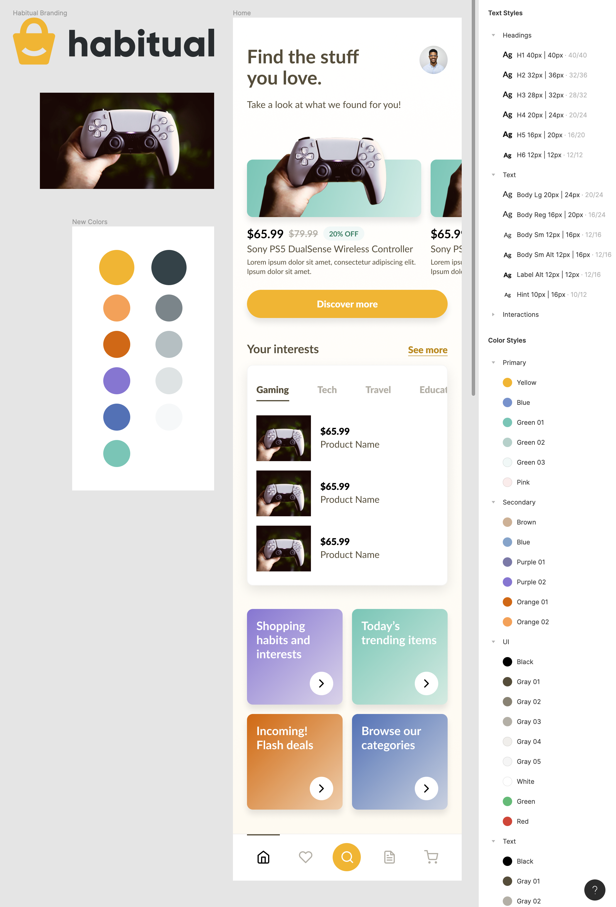

# Section 22 - Visual Style & Exploration

## Design Fidelity

Start with sketches and wireframes

- Build your way up gradually over time
- Final designs require a lot of testing and refinement

The center of the design process (apply to everything you do):

- Build
  - Explore ideas
  - Prototype possibilities
- Measure
  - Always testing assumptions
  - Put product in front of users
  - Seek feedback early
- Learn
  - Validate
  - Squash assumptions
- Repeat - continuously incorporate / fine-tune

Go back to initial wireframes

- Review hierarchy, typography, style, etc.
- Ask a lot of questions. What works? What doesn't?
- Do not make large decisions without proper feedback
- Test all assumptions

Jumping into high-fidelity designs without early user testing and feedback will really make things difficult later. Don't do it!

## Style Exploration

- - -

[back](../README.md)
