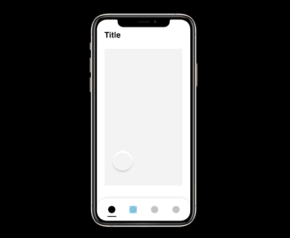

# Section 23 - Motion

## The Importance of Motion

Motion has the ability to create a great user experience

- Gives users the ability to easily follow along
- "Motion tells stories. Everything in an app is a sequence, and motion is your guide. For every button clicked and screen transition, there is a store that follows." - Craig Dehner, Former Human Interface team at Apple
- Motion is often an afterthought
  - It is incredibly important and should be incorporated earlier in design process
- Too much motion can degrade the UX
  - Should be used as a tool to provide users with easily noticeable smooth feedback
  - Think about user flow and the brand you're designing for
- Motion can be used subtley for delight, or for the purpose of state change and visual cues.
- Again, motion should not be overused or overwhelming. It should be *very* subtle.

### Good Motion is Invisible

- Users should not realize that they're looking at animations/motion
- It should not be distracting
- They should only notice the great, seamless experience

## The Purpose of Motion

When we use motion in a subtle way, it helps to build mental models of how our system works and how users can interact with it.

- Animation can be brought in for usability or clues for what is happening within a product
- Motion can signify how UI elements behave

### State transitions

- These can involve hard cuts from one screen to another
  - Not having any transition here is a big no-no and can be very disorienting
  - Can make things difficult to follow
  - Motion will help smooth state transition

### Visual Feedback

- Users want to know their current context within a system at any given time, they should not have to guess.
  - Buttons are a great way to show visual feedback when there is interaction happening

### Visual Cues

- Animation helps guide users' attention to certain areas, directing their focus to the right spot at the right time.
  - Onboarding features or teaching new users how to use an app
  - Interacting with elements - carts, notifications, etc.

## Intro to Smart Animate

- Naming conventions are very important in smart animate
  - Otherwise nothing would happen between multiple versions of a screen when prototyping
- "Smart Animate matching layers" - all layers with same name will be animated within a flow

## The Power of Smart Animate

- - -

[back](../README.md)
