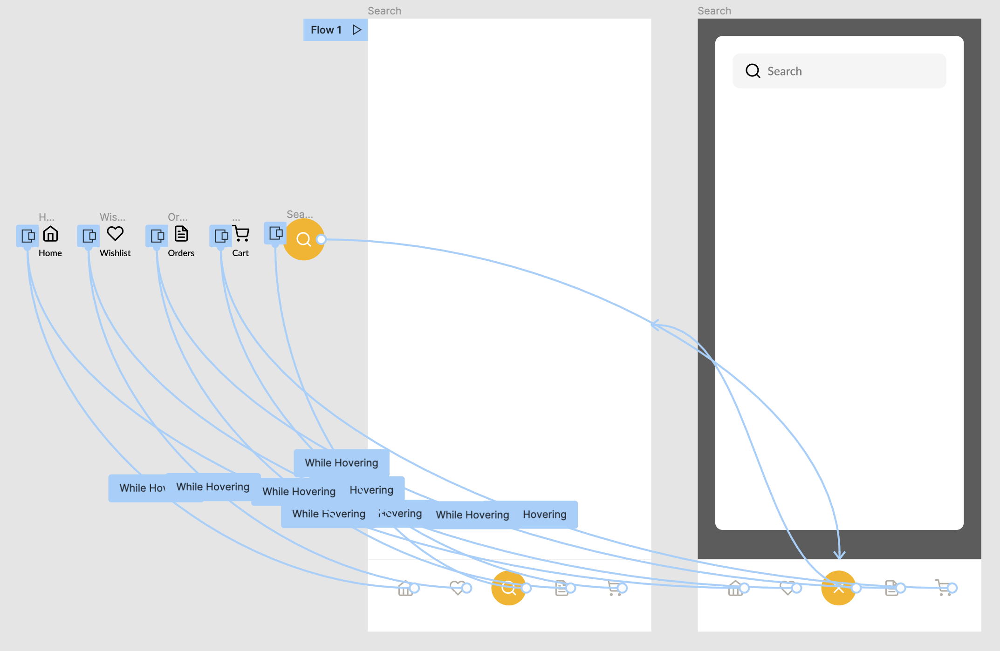

# Section 24 - Microinteractions

## What Is a Microinteraction?

Microinteractions are contained product moments that are meant for a single use case.

- They are ***very*** important!
- They have the power to make an experience much more effective and human.
  - Ex: setting an alarm, checking notifications, adding to cart
- They help communicate the **tone** of your brand

### Structure of a Microinteraction:

1. Trigger
    - Can be user initiated - Swipe, click, etc.
    - Can be initiated by a product or system - notification
2. Rules
    - Determine how microinteractions respond to a trigger
    - Define what happens during interaction
    - Not typically seen by user, takes place in background
3. Feedback
    - Tells user what is happening
    - Ex: Focused / Success / Error input field
4. Loops + Modes
    - How microinteractions change when they are used
    - Ex: Saved passwords, data collection, auto complete based on previous input

### Other examples of microinteractions:

- Scrollbars - triggers, visual feedback
- Alarms - triggered by system or user
- Buttons (SOMETIMES) - only if there is feedback / state change on click
- Pull to refresh - user triggered, visual feedback
- Swiping animations
- Notifications
- Video player buttons (volume, play/pause)

### Not every element is a microinteraction

- Static elements
- Flows with multiple actions
- Buttons without feedback
- Video players themselves
- Gifs

## Why Are Microinteractions So Important?

### Great microinteractions can push our products over the edge

- During the design process, they may seem like much smaller details of a broader experience
  - These details will have a large impact on whatever you're building
  - Give users a good impression of your product

### In most cases the difference between products we tolerate and products we love are the quality of the microinteractions

- Polish and quality
- Focus on designing small moments
  - These lead to ease of use and delight

### Microinteractions **provide feedback** to users

- Products should be intuitive no matter what
- Consider the user's journey
- Look for places where user would need feedback and reassurance
  - Ex: Confirmation of successful transactions (checkout, payment, etc.)

### They help **prevent errors**

- Common UX practice
  - Inline validation vs input error after submission
  - Make it easy for users to undo actions
- Help communicate component states
  - Suggests that further action is possible

### They can create **seamless experiences**

- Reduce effort required of users
  - Swiping vs tapping
  - Pulling to refresh - receive more information

### They encourage engagement

- Animated feedback, special celebratory moments
- Keep users excited about product

### Again, they help communicate the tone of your brand

## Creating Our Own Microinteraction

- - -

[back](../README.md)
