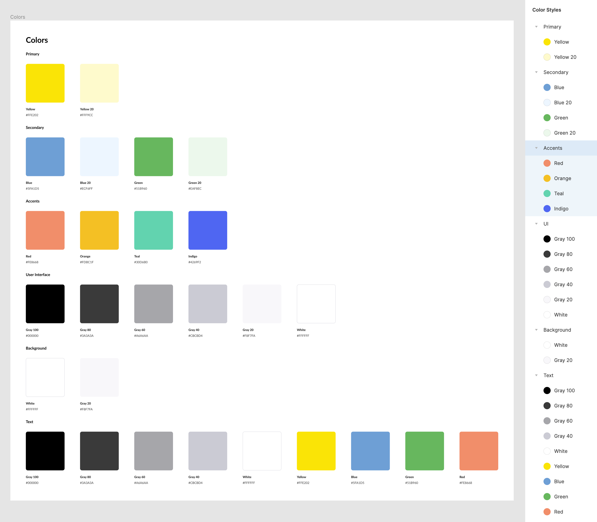
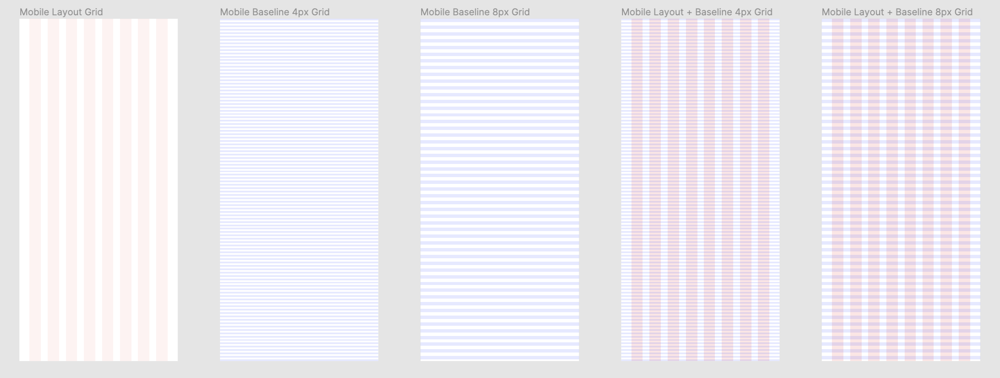
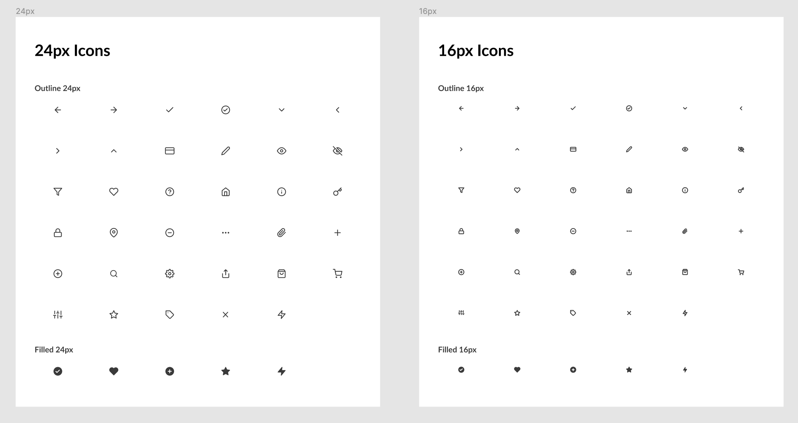
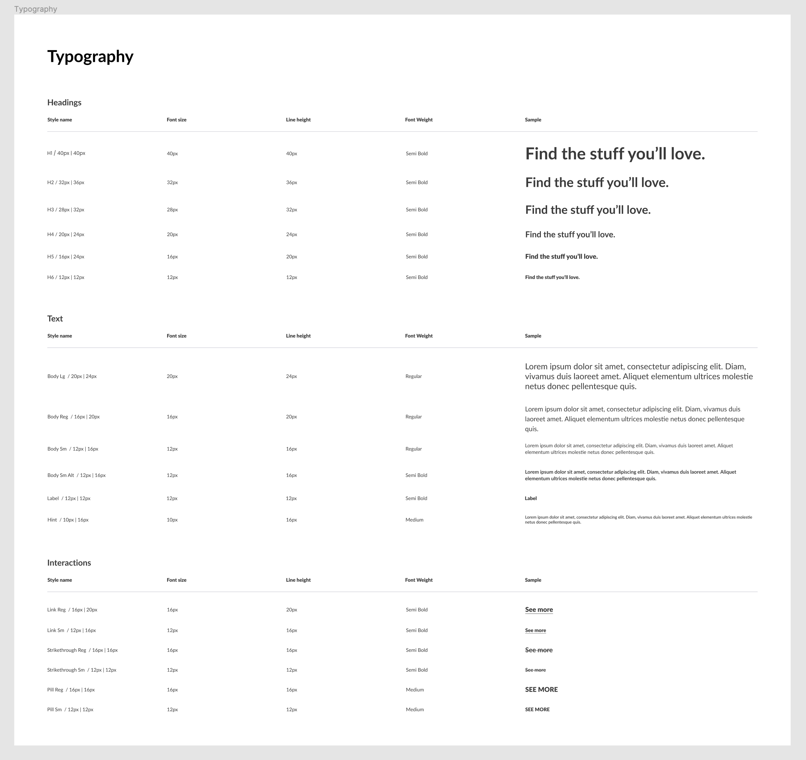

# Section 26 - Design Systems

## What Is a Design System?

Also known as UI toolkits, design systems involve a more broad team including developers.

- Ours is broken up into a foundation, a components section (atoms), and recipes (larger components)
  - Components will use the foundation
  - Recipes will be more complex components made up of smaller components and foundation elements

## Foundation - Color

- Comprised of Primary, Secondary, Accents, User Interface, Background, and Text
  - Variants use numbers which indicate different color opacity percentages
  - All colors are saved as styles
- Do not give yourself TOO many options
  - Accents will be used sparingly
  - UI colors give us flexibility with grayscale vs background and text
    - 4 variants of gray (80, 60, 40, 20)
  - Text grayscale will help with hierarchy

## Foundation - Grids + Spacing

4 pixel grid in multiples of 8

- 8 column mobile layout grid, 24px margin, 16px gutter
- 4px baseline grid for vertical spacing, auto count, blue, top type, 4px gutter
- 8px baseline grid as well
- 8 column + 4px baseline grid
- 8 column + 8px baseline grid

## Foundation - Iconography

Feather Icon plugin, both in 24px and 16px

- Both Outlined and Filled icons
- All icons created as components
  - Easy to drag and drop
  - Easy to change under instances on right menu
- 16px icons appear slightly thicker

## Foundation - Typography

Typography will make up a lot of your components and designs

- Font size and line height increments based off of 4 and 8 pixels
- Headers - H1 through H6, semi bold font weight
- Text category will refer to body copy, labels, and hints
  - Anything smaller than 16px on smaller screens will bring readability issues
- Interactions consist of links, strikethroughs, and pills
  - Create variants (regular vs semi-bold) just in case you need them
- All typography is saved as text styles

Design systems will provide context and a deeper understanding of styles

- A language for an entire team, not just designers
- Different design systems can be created for different purposes
  - Ex: Product vs marketing site

## Components - Buttons

## Components - Inputs

## Components - Cards

## Recipes - Vertical Cards

## Recipes - Search

## Recipes - Order List

- - -

[back](../README.md)
