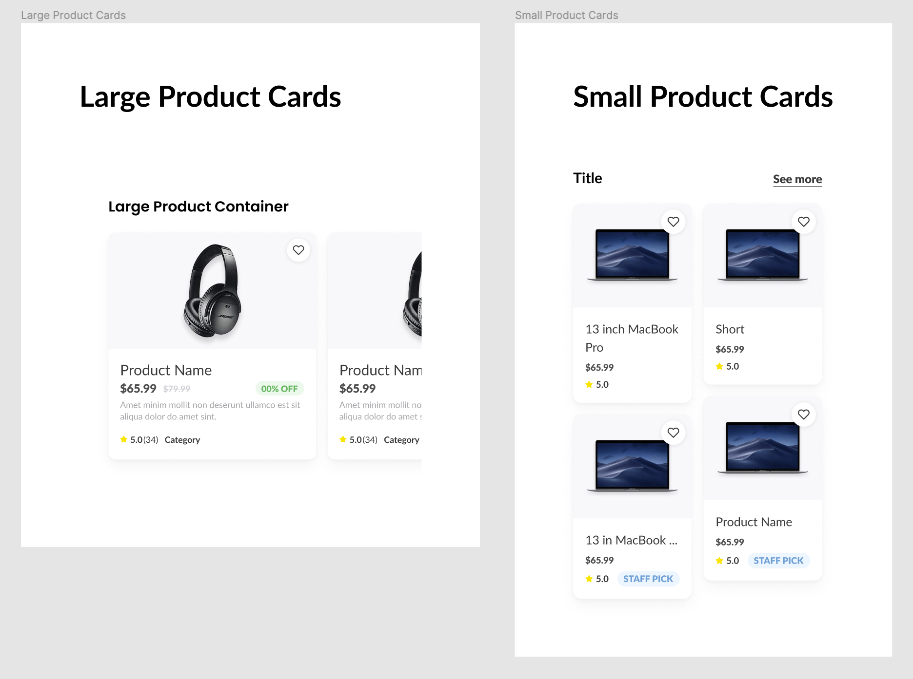
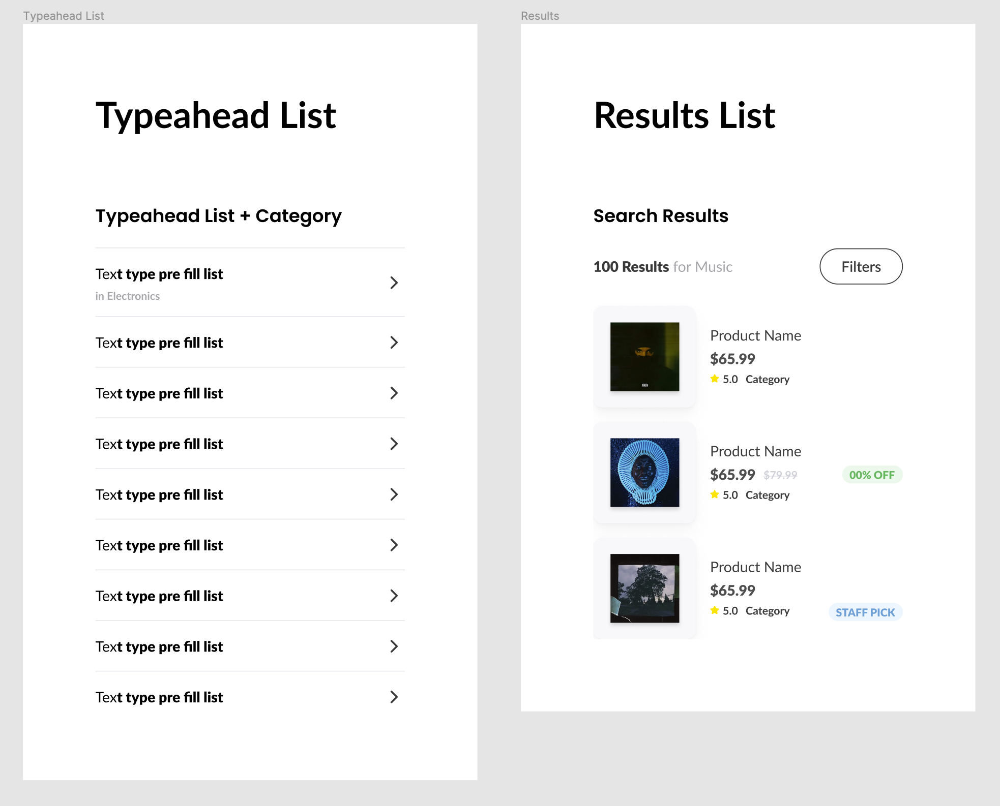

# Section 26 - Design Systems

## What Is a Design System?

Also known as UI toolkits, design systems involve a more broad team including developers.

- Ours is broken up into a foundation, a components section (atoms), and recipes (larger components)
  - Components will use the foundation
  - Recipes will be more complex components made up of smaller components and foundation elements

- - -

## Foundation - Color

- Comprised of Primary, Secondary, Accents, User Interface, Background, and Text
  - Variants use numbers which indicate different color opacity percentages
  - All colors are saved as styles
- Do not give yourself TOO many options
  - Accents will be used sparingly
  - UI colors give us flexibility with grayscale vs background and text
    - 4 variants of gray (80, 60, 40, 20)
  - Text grayscale will help with hierarchy

- - -

## Foundation - Grids + Spacing

4 pixel grid in multiples of 8

- 8 column mobile layout grid, 24px margin, 16px gutter
- 4px baseline grid for vertical spacing, auto count, blue, top type, 4px gutter
- 8px baseline grid as well
- 8 column + 4px baseline grid
- 8 column + 8px baseline grid

- - -

## Foundation - Iconography

Feather Icon plugin, both in 24px and 16px

- Both Outlined and Filled icons
- All icons created as components
  - Easy to drag and drop
  - Easy to change under instances on right menu
- 16px icons appear slightly thicker

- - -

## Foundation - Typography

Typography will make up a lot of your components and designs

- Font size and line height increments based off of 4 and 8 pixels
- Headers - H1 through H6, semi bold font weight
- Text category will refer to body copy, labels, and hints
  - Anything smaller than 16px on smaller screens will bring readability issues
- Interactions consist of links, strikethroughs, and pills
  - Create variants (regular vs semi-bold) just in case you need them
- All typography is saved as text styles

Design systems will provide context and a deeper understanding of styles

- A language for an entire team, not just designers
- Different design systems can be created for different purposes
  - Ex: Product vs marketing site

- - -

## Components - Buttons

- Base - a version without any styles added
  - Grow based button - grows/shrinks with content within
    - Frame will need to be dragged to edge to fit new button size
  - Fixed based button - stays the same size regardless of content
    - Used for full width buttons
  - A `period` at the beginning of a component name will hide it from the component list (paid account)
    - Paid account is also needed to use design system across other files
  - 48px height is "Regular" height
- Primary - grow, fixed
  - Default, active, disabled
- Secondary - grow, fixed
  - Default, active, disabled
- Tertiary - grow, fixed
  - Default, active
- Desktop should also include hover states
- Consider all types of use cases for various buttons / components / styles
- All button components become saved under assets

- - -

## Components - Inputs

- Again, general input will be base style
  - Content area - text and left icon
  - Right icon
- Label - left and right content
  - Both set up with auto layout
- Word Counter
- Field Message - success or error, with icon

Inputs:

- Placeholder - unselected, disabled, error
- Empty - unselected, selected (or focused), disabled, error unselected, error selected
- Filled - unselected, selected, disabled, error unselected, error selected, success unselected, success selected

Form Fields - include labels at top, field messages at bottom:

- Placeholder - unselected, disabled, error
- Empty - unselected, selected, disabled, error unselected, error selected
- Filled - unselected, selected, disabled, error unselected, error selected, success unselected, success selected

Instances can be used as is, new components don't always need to be created

- Elements can simply be toggled off/on as needed

- - -

## Components - Cards

Cards can be simple or complex. They can be made up of typography, imagery, icons, buttons, pills, etc.

- Base card includes everything, all different use cases
  - Image, reviews, staff pick, sale percentage, strikethroughs
  - Image selector frame uses RemoveBG plugin for multiple categories of images
  - Both vertical and horizontal
- Default vertical card - image on top, description on bottom
  - Uses auto layout (not responsive)
  - Image, product name, price, short description, reviews, category
- Variations - sale, staff pick, smaller size (category pages, stacking in grid)

- Search result cards are horizontal
  - Image on left, description on right
  - Optional pills on far right (sale, staff pick)
- Wishlist cards are also horizontal
  - Include CTA Add to cart button

As we create a design system, we are also creating a language

- - -

## Recipes - Vertical Cards

Recipes can also be referred to as collections of components

- Groups of vertical cards
  - Horizontal scrolling (large)
  - Category / search results (small)

- - -

## Recipes - Search

- This is good practice for learning Auto Layout
  - Recipes are essentially massive groups of frames inside frames inside frames
    - Think rows first, and then columns inside those rows
    - And then smaller rows could also be inside those columns, etc.

- - -

## Recipes - Order List

- - -

[back](../README.md)
