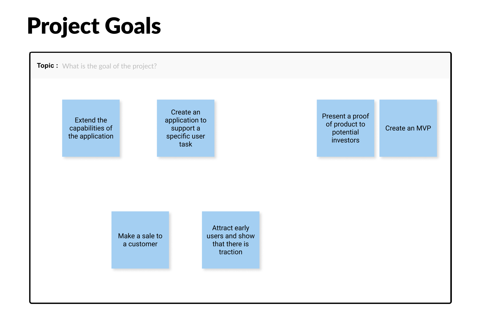
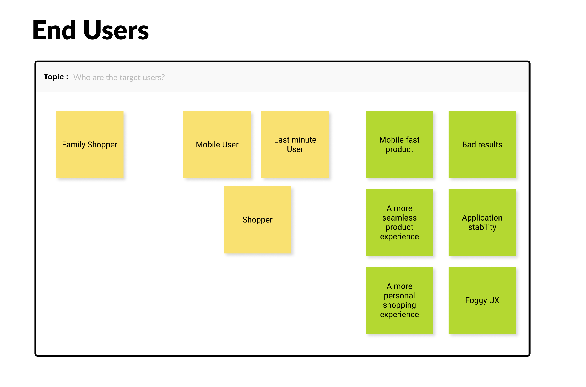
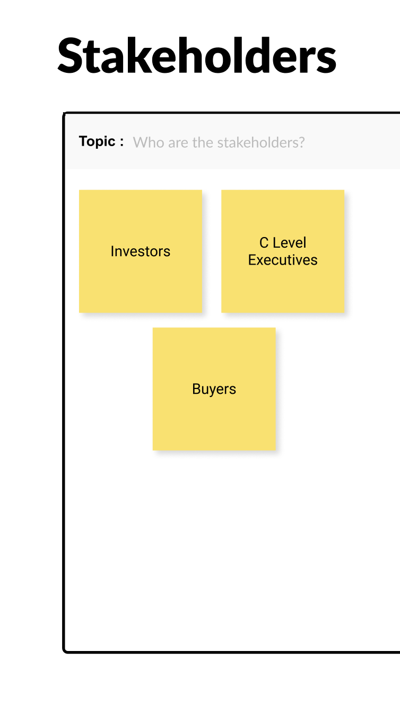
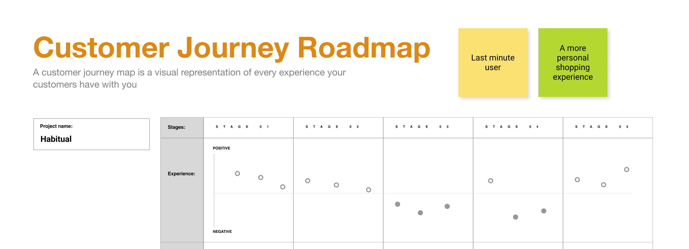
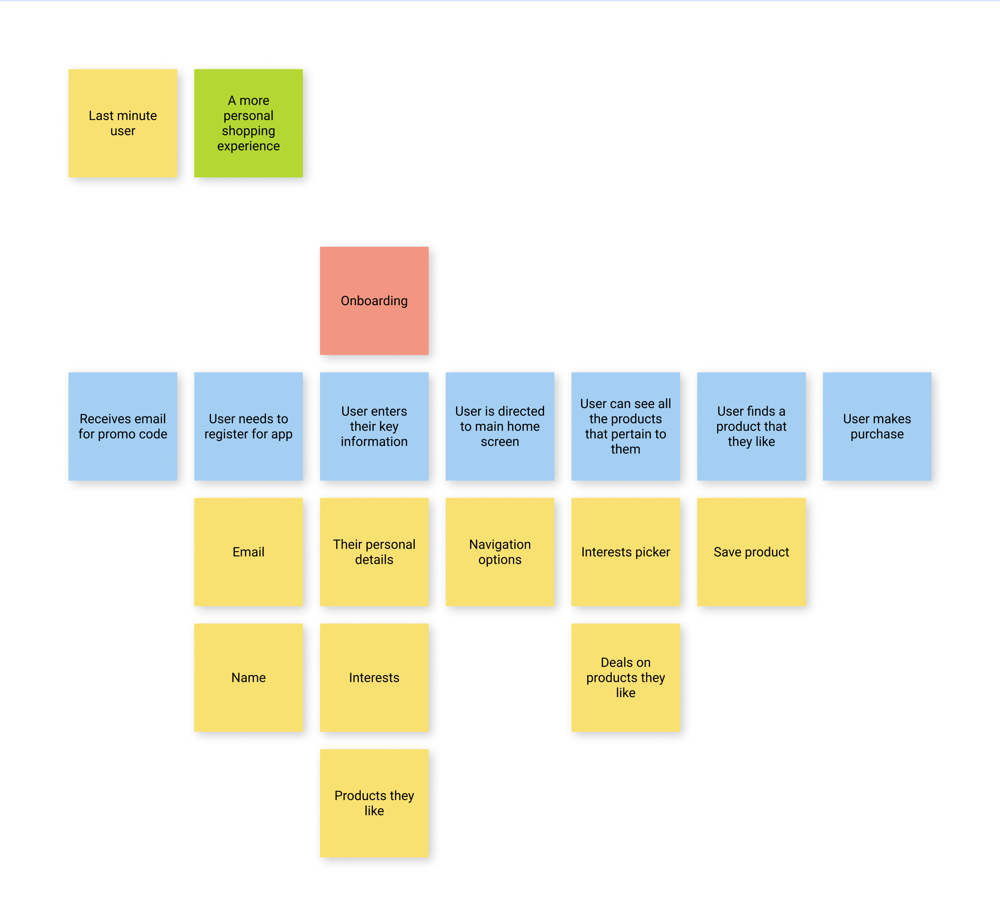
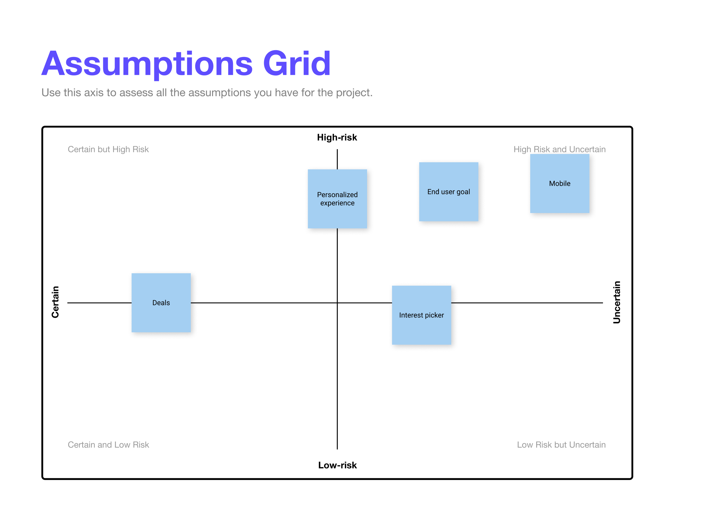

# Section 28 - Working With a Client Revisited

## The Product Alignment Canvas

- Asking basic questions about why we should be doing something
  - Learning about assumptions around our users
  - Meeting should consist of product team (designers, developers, managers, QA), clients, stakeholders
    - All contribute to success of project
  - Practice facilitation skills
- Product Planner is a useful Figma plugin that provides a wide array of templates
- Focus on project goals, target users, and user journeys

## Project Goals

- What does a successful outcome look like?
  - This is done collaboratively, to reveal everyone's perspectives
  - Resolve conflicting priorities
    - What problems are you trying to solve for this product?

## Target Users

### 2 types of users - end users and stakeholders

- Whose cooperation is required to the make project successful?
  - United by common goals and concerns
  - Varying roles and occupations
- The goals of end users provide opportunities for developing features to help them get there faster, easier, or with more engagement
  - Concerns help us understand what may hinder successful usage
- What frustration or pain point are we trying to alleviate?

- Success of the project can sometimes rely upon stakeholders more than end users
  - Understanding goals and concerns of key stakeholders can inform decisions and reveal opportunities to validate direction of the product early and often
    - Reduces probability of failure
    - Key questions
    - What risks are they concerned about?

### **End users:** help make decisions on what to build
### **Key stakeholders:** provide opportunities to involve those who can influence the success of the project early

## User Journey Map

User journey: The steps a user needs to take from beginning to end to complete a goal

- Easiest and most basic way is to use a whiteboard and stickies
  - Gather all tasks and features needed
  - Is the customer experience positive or negative?
  - Are there needs, interactions, or opportunites for improvement?
  - Some tasks will need to be reassessed and are sometimes added to a backlog

## Risky Assumptions

- One of the primary sources of wasted effort when building applications
  - Team can help reduce risk and uncertainty by calling out all this information during initial canvas
  - Place asterisk next to low confidence assumptions

Examples of assumptions that can affect success of a project if proven wrong:

- Personalized experience will be better for users
- Building features of little value to end users
- Types of users / devices
- End user goal

At the end, we will do our best to validate assumptions

## What is a User Story Map?

## Creating a User Story Map

- - -

[back](../README.md)
