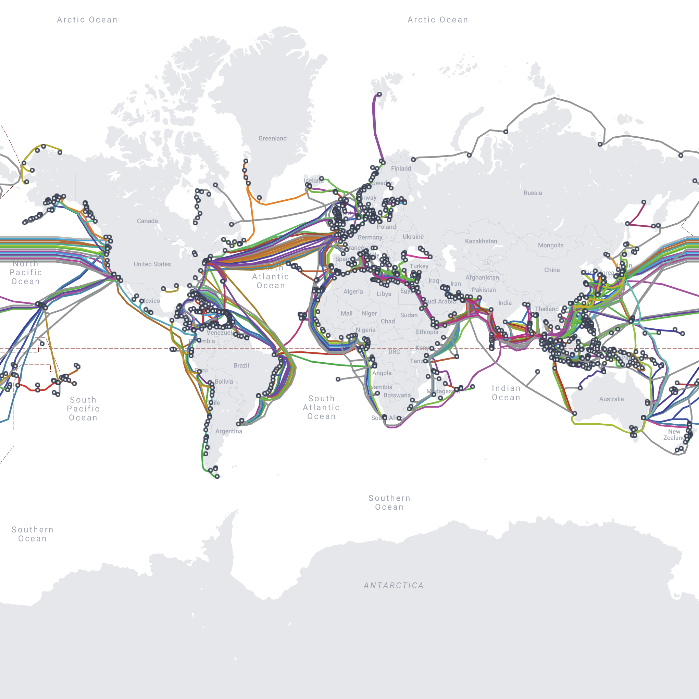
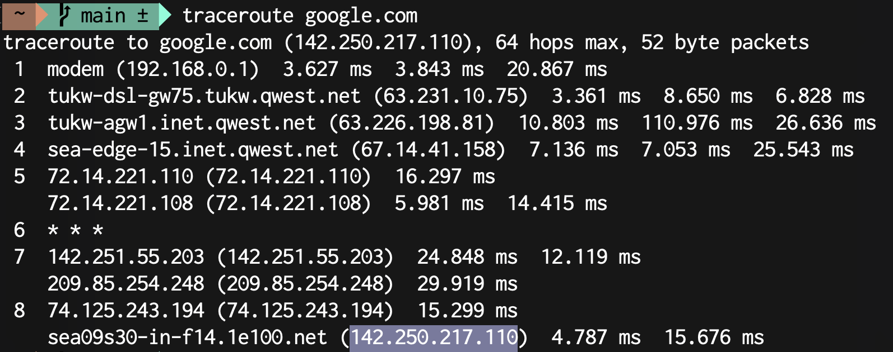

# Section 32 - Extra: How the Internet Works

## Browsing the Web

- When we enter a URL in a browser (eg: Google Chrome), we are asking a question (or **request**) to our Internet Service Provider
- The ISP then sends that request to the Domain Name Server (DNS)
  - Essentially a phonebook
- An IP address (eg: 172.217.7.23) is then sent back from DNS to ISP, then ISP to browser
  - The IP knows our location and allows the internet to work
- The browser sends another request to the servers (of the site we're requesting) using the IP
  - Servers are essentially other computers with software running that knows how to send you files
- Server will then send HTML, CSS, and JavaScript files back to browser
- Browser then renders the website you requested

## Breaking Google

- Using developer tools, we can inspect elements and change values or properties to modify how the page renders
  - We can even delete elements
- As soon as we refresh the page the request is resent and the original files (HTML, CSS, JS) are provided again from the server

## The Internet Backbone

- WiFi gives us internet through a router
- Router is connected to a modem which allows ISP to connect to it through signal towers (wireless transmitters)
- Signal towers are connected directly to ISP through cables, ISP is also connected to Internet Backbone through cables

### The Internet Backbone is a network comprised of physical submarine cables that run along the bottom of the sea floor

- Allows us to transfer files all over the world in seconds



- Taken from [submarinecablemap.com](https://www.submarinecablemap.com/)

The Opte Project [Internet Timelapse](https://www.youtube.com/watch?time_continue=57&v=DdaElt6oP6w&feature=emb_title) 1997-2021

- The internet is essentially a network of connected computers that can transfer files between each other

## Traceroute

In terminal:

```pt
traceroute google.com
```



- Shows various stops made to arrive at final IP address
- Traceroute monitors where your requests go
  - All IP addresses are different computers attempting to locate Google servers

## Developer Fundamentals: I

## What Does a Developer Do?

- - -

[back](../README.md)
