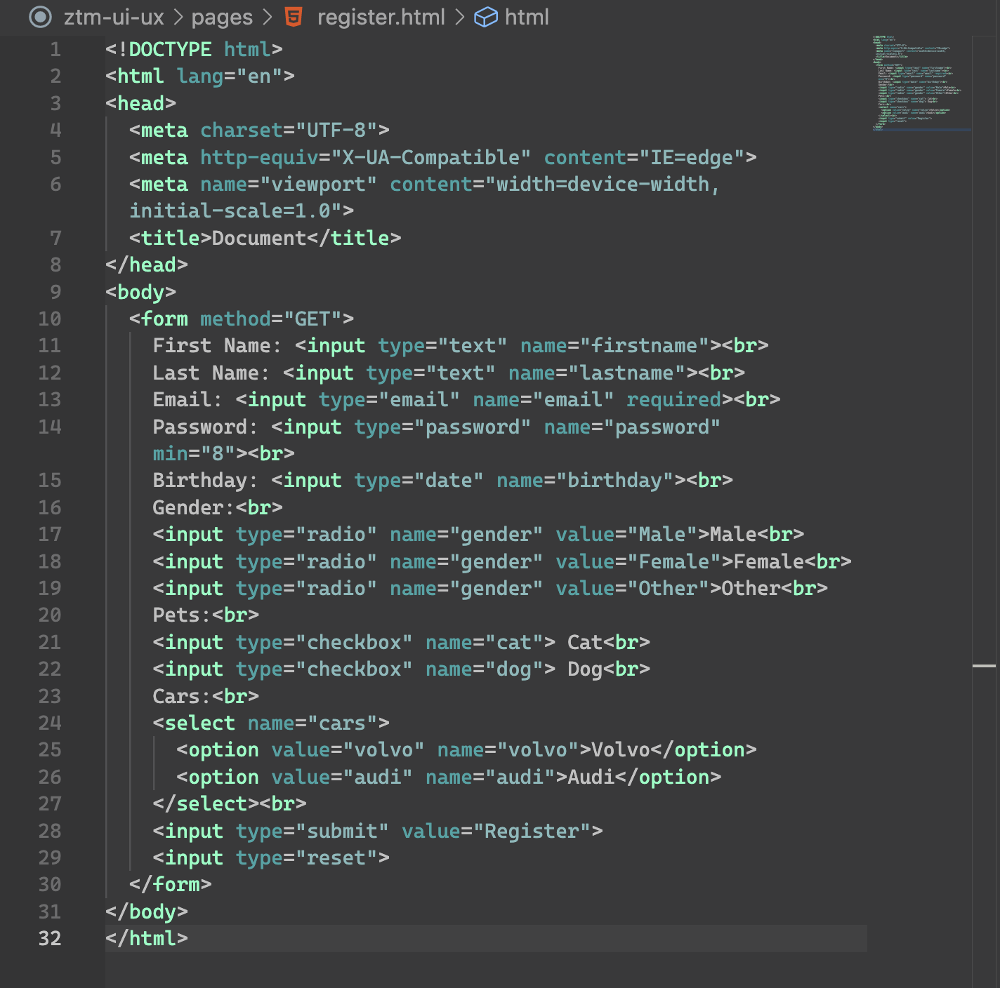
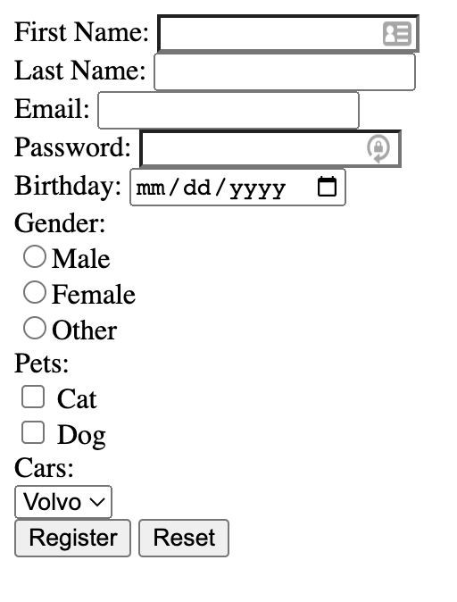

# Section 34 - Extra: HTML 5

## Build Your First Website

- A text editor is a program that allows us to write code
  - VSCode, Sublime Text, etc.

## Developer Fundamentals: III

As developers, we must get really good at problem solving, ie: using Google ***all the time***.

- For example, searching "doctype html", from w3schools.com:
  - Definition and Usage
    - All HTML documents must start with a <!DOCTYPE> declaration.
    - The declaration is not an HTML tag. It is an "information" to the browser about what document type to expect.
    - In HTML 5, the declaration is simple:

      ```html
      <!DOCTYPE html>
      ```

## HTML Tags

HTML consists of opening and closing tags

- `<h1>` - `<h6>`: headers
- `<p>`: paragraph
- `<h1>` would just be a *tag*, whereas `<h1>`HELLO`</h1>` would be an *element*.
- `<b>` (bold) and `<i>` (italic) aren't really used anymore
  - `<strong>` is instead used for bold, `<em>` is used for "emphasis" (italic)
- ordered lists, with list items:

  ```html
  <ol>
    <li>banana</li>
    <li>apple</li>
    <ul>
      <li>fuji</li>
      <li>honeycrisp</li>
    </ul>
    <li>orange</li>
  </ol>

  becomes:

  1. banana
  2. apple
    * fuji
    * honeycrisp
  3. orange
  ```

  - `<ul>`: unordered list

## Self Closing HTML Tags

- `<br>`: line break
- `<hr>`: horizontal rule
- ``: image
  - `src`: source
    - attribute, these will always have values attached to them
    - also `alt`, `width`, `height`, etc.

## Anchor Tag

`<a href="URL">`text`</a>`

- Hypertext Reference

## Q&A: index.html

Most servers will by default return `index.html` first.

- This is therefore just common practice that the first page or 'home' page will always be named `index.html`.

## Q&A: Relative vs Absolute Path

- Relative path is relative to our `index.html`
  - Within our site or directory
  - Does not need a full URL, eg: a link to `newpage.html`
- Absolute path is an explicit URL to any webpage outside of our directory that can be accessed from anywhere

## HTML Forms

[HTML file for Register form](../section34/register.html)




## Submitting a Form

`<form method="GET">` or `"POST"`

- Query strings - values entered become attached to URL
  - Correspond with names for each input
  - Composed of properties and values, where property is name, value is whatever input is provided by user

```pt
(property=value)

? (indicates data that will be entered)
firstname=fake
&lastname=man
&email=fake%40gmail.com
&password=123
&birthday=2022-07-14
&gender=Male
&cat=on
&cars=audi
```

- URL encoding: &, %20, %40, etc.

## More HTML Tags

- `<!-- comment -->`
  - Use `cmd /` as shortcut
- `<div>` - a container that becomes powerful with CSS
  - Allows us to divide up, layout, and style content
- `<span>` - same as div, but an *inline* element (as opposed to *block*)

## HTML vs HTML 5

HTML5 was the evolution of HTML that enabled the improvement of user experience across all browsers and devices.

- Tries to improve the performance of the web, as we are constantly evolving
- Does not affect old websites (backwards compatible)
- New features and **Semantic Elements**
  - `<article>`, `<aside>`, `<details>`, `<figcaption>`, `<figure>`, `<footer>`, `<header>`, `<main>`, `<mark>`, `<nav>`, `<section>`, `<summary>`, `<time>`
  - Make websites more descriptive
  - Search engines use crawlers to read through HTML and understand what a website is

    ```html
    <header>
      <h1>Register</h1>
    </header>
    <nav>
      <a href="https://www.google.com/">Google</a>
    </nav>
    <footer>
      <p>Website made with love</p>
    <footer>
    ```

- Many new attributes as well
  - eg: for `<input>`
    - `disabled`, `max`, `maxlength`, `min`, `palette`, `readonly`, `required`, `size`, `step`, `value`

- - -

[back](../README.md)
