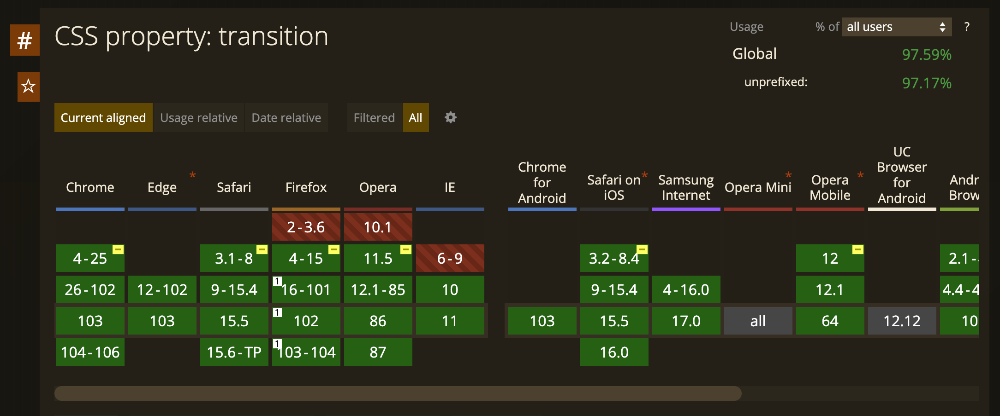

# Section 35 - Extra: CSS 3

## Your First CSS

Cascading Style Sheets

- Cascading - always takes selector at the end
- ` <link rel="stylesheet" type="text/css" href="style.css">`
  - Reference stylesheet in `<head>` section of html file
  - Ideal for larger pages/files
- Can also use inline styling in `<body>`, or `<style>` tags in `<head>`
- Separation of concerns - allows developers to work on separate HTML and CSS files, as opposed to using inline styling

## CSS Properties

CSS Example from exercise:

```css
body {
  background-image: url(img/background-img.jpg);
  background-size: cover;
}

h2 {
  color: #AA3939;
  text-align: center;
  border: 2px solid rgba(255, 170, 170, 0.5);
  cursor: pointer;
}

p {
  color: green;
}

li {
  list-style: none;
  display: inline-block;
}
```

## CSS Selectors

### CSS Cheat Sheet

Reference:

- [CSS Selector Reference](https://www.w3schools.com/cssref/css_selectors.asp)
- [CSS Tricks Almanac](https://css-tricks.com/almanac/)
- [Cascade and Inheritance](https://developer.mozilla.org/en-US/docs/Learn/CSS/Building_blocks/Cascade_and_inheritance)

Cascading Style Sheets - at the most basic level it indicates that the order of CSS rules matter.

```pt
.class (many)
#id (only one)
* (all)
element
element, element (both)
element element (one inside other)
element > element (only applies to child of parent)
element + element (exactly after, not inside)
:hover
:last-child
:first-child
!important (not recommended) (overrides all, breaks the rules of cascading)
```

What selectors win out in the cascade depends on:

- Specificity ([Specificity Calculator](https://specificity.keegan.st/))
- Importance
- Source Order

Inline styles will always take most specificity / priority

## Text and Font

- Import from Google Fonts
  - `  <link href="https://fonts.googleapis.com/css2?family=Poiret+One&display=swap" rel="stylesheet">`

```css
p {
  line-height: 50px;
  font-style: italic;
  font-weight: bold;
  font-size: 180%;
  font-family: 'Poiret One', cursive;
}
```

## Images in CSS

```css
img {
  float: right;
}

footer {
  clear: both;
  text-align: center;
}
```

## Box Model

```css
.boxmodel {
  border: 5px solid red;
  display: inline-block;
  padding: 5px 20px;
  margin: 0px 20px;
  width: 33px;
  height: 55px;
}
```

## px vs em vs rem

- pixels are absolute units
- `em` is the size relative to it's parent element

```css
p {
  font-size: 10px;
}

span {
  font-size: 3em;
}
```

- `rem` is the size relative to root element (`<html>`)
  - Changing parent element does not affect this

[What’s The Difference Between PX, EM, REM, %, VW, and VH?](https://elementor.com/help/whats-the-difference-between-px-em-rem-vw-and-vh/)

## Critical Render Path

A path that a website takes to display something to the user

- Our website will be on a server
- Browser requests HTML file from server
- Browser sees file and reads through document
- Then makes a request for CSS file from server
- Browser will look at both HTML and CSS files to render/display page.
- Browser will request any fonts needed (eg: Google API)

### **CSS is a render blocking file**

A browser cannot render a webpage until it receives the CSS

- If there are font files, you will also have to wait for text to render on page

### **How to make websites load faster?**

- Provide your own font files
- Do not make CSS files too large
  - *Minifying* your CSS - [CSS Minify](https://www.cleancss.com/css-minify/)
    - Removes all white space, so all code is on one line, drastically reducing file size

## Flexbox

```css
.container {
  display: flex;
  flex-wrap: wrap;
  justify-content: center;
}

h1 {
  font-family: fantasy;
  font-size: 3em;
  border-bottom: 2px solid pink;
  border-right: 2px solid pink;
  border-radius: 0 0 16px 0;
  width: 400px;
  text-align: center;
}

img {
  width: 450px;
  height: 300px;
  margin: 10px;
  box-shadow: 0 12px 32px -12px rgb(0 0 0 / .5);
  border-radius: 16px;
}
```

- [CSS Flexbox](../section35/flexbox/index.html)
- [ Flexbox Froggy Exercise](http://flexboxfroggy.com/)

## CSS 3

CSS is a standard that constantly evolves to adapt to new demands of websites

```css
img {
  transition: all 1s;
}

img:hover {
  transform: scale(1.1);
}
```

- [CSS Browser Support Reference](https://www.w3schools.com/cssref/css3_browsersupport.asp)
  - Browser support prefixes:
    - `-webkit-` (Safari / Chrome / Edge)
    - `-moz-` (Firefox)
    - `-ms-` (Internet Explorer)
    - `-o-` (Opera)
- [Can I use ___ ?](https://caniuse.com/)



## Responsive UI

- - -

[back](../README.md)
