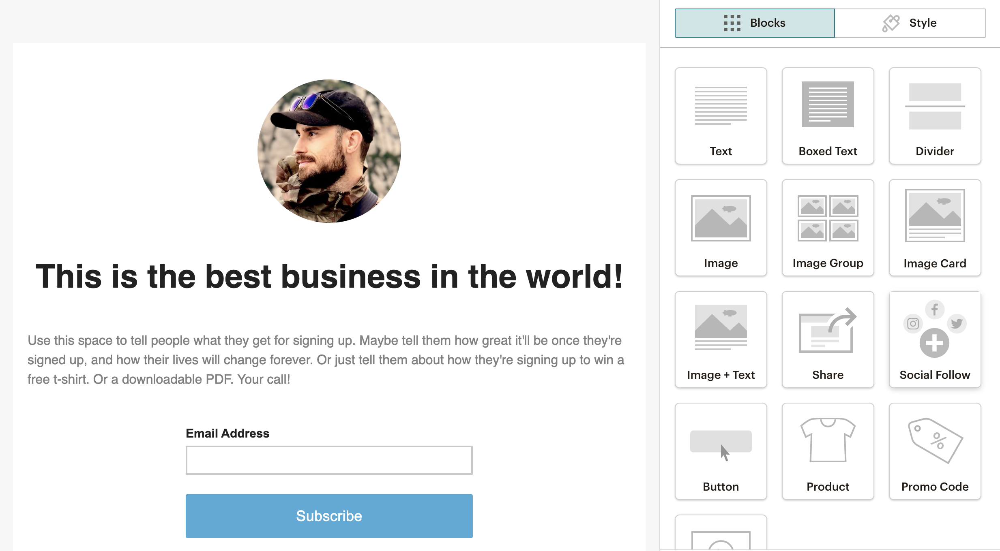

# Section 36 - Extra: Bootstrap, Templates, and Building Your Startup Landing Page

## Evolving Technology

- What we're learning will always change over the years
  - Everything in tech moves and changes quickly
  - Programming languages, text editors, dependencies, best practices, libraries, APIs
- This course is designed to learn old methods (eg: React) and update them
- A developer is maintaining software and programs, which are always evolving
  - Ensure that your code is running years from now
- Developers are problem solvers, constantly fluidly changing and evolving *with* the technology

## Bootstrap Introduction

[getbootstrap.com](https://getbootstrap.com/)

- Bootstrap is essentially a CSS file and a JavaScript file
  - It prevents us as developers from having to keep reinventing the wheel
  - Enables us to build websites very quickly
  - Components can be implemented as UI elements
- With the component building blocks, you can use Bootstrap classes as well as add custom CSS styles on top
  - Enables endless customization

## Bootstrap

- CSS and JS files could be downloaded
- Or linked through a CDN
  - Content Delivery Network, where Bootstrap hosts the files for us
  - [What is a CDN?](https://www.cloudflare.com/learning/cdn/what-is-a-cdn/)

  ```html
  <link href="https://cdn.jsdelivr.net/npm/bootstrap@5.2.0/dist/css/bootstrap.min.css" rel="stylesheet" integrity="sha384-gH2yIJqKdNHPEq0n4Mqa/HGKIhSkIHeL5AyhkYV8i59U5AR6csBvApHHNl/vI1Bx" crossorigin="anonymous">
  <link rel="stylesheet" type="text/css" href="style.css">
  <!-- Our own stylesheet will override Bootstrap's default styles -->
  ```

  ```html
  <!-- Always place JavaScript at bottom of <body> -->
  <script src="https://cdn.jsdelivr.net/npm/bootstrap@5.2.0/dist/js/bootstrap.bundle.min.js" integrity="sha384-A3rJD856KowSb7dwlZdYEkO39Gagi7vIsF0jrRAoQmDKKtQBHUuLZ9AsSv4jD4Xa" crossorigin="anonymous"></script>
  ```

[Bootstrap exercise](../section36/bootstrap/index.html)

## Bootstrap 5 Update

- Packages, libraries, and tools are constantly being updated
  - Projects must be maintained
  - Bootstrap's latest version is 5.2.0, and our code must reflect that.

## Bootstrap Grid

[Grid Documentation](https://getbootstrap.com/docs/5.2/layout/grid/)

```html
<!-- These columns will be responsive depending on window or device size. -->

<div class="container">
  <div class="row align-items-start">
    <div class="col col-sm-6 col-md-12 col-lg-12">
      1 of 3 columns
    </div>
    <div class="col col-sm-3 col-md-6 col-lg-12">
      2 of 3 columns
    </div>
    <div class="col col-sm-3 col-md-6 col-lg-12">
      3 of 3 columns
    </div>
  </div>
</div>
```

## Exercise: Startup Landing Page

- `<meta>` tags allow us to add new information to our page
- `viewport` allows us to create webpages that are *mobile first*
  - scrolling, touching, zooming, etc.
- `utf-8` is the form of encoding to write text on a webpage

```html
<meta charset="UTF-8">
<meta http-equiv="X-UA-Compatible" content="IE=edge">
<meta name="viewport" content="width=device-width, initial-scale=1, shrink-to-fit=no">
```

### Landing Page Exercise

- [HTML with Bootstrap](../section36/startup/index.html)
- [CSS](../section36/startup/style.css)

## Exercise: Adding Email Subscribe Form with MailChimp

Mailchimp is an email marketing service

- It is easy to use and edit templates to allow users to sign up for mailing lists



## Exercise: Putting Your Website Online

We can use GitHub pages to easily publish our pages to the web

[Deployed Startup Landing Page](https://ryanemmans.github.io/startup/)

## Developer Fundamentals: IV

- When we're building websites, it is very rare that we build something from scratch
  - Most of the time you will build on top of something that has already been created
  - Otherwise the entire developer environment will be very tedious
- Be efficient with your time and limited resources
  - Seek out tools and libraries (eg: Bootstrap or animate.style) that already exist that will solve your problems.
  - If they don't exist already, *then* you can implement your own
- [Animate.style/](https://animate.style/) (Previously animate.css)
- [Creative Tim](https://www.creative-tim.com/) - Fully Coded UI Tools and Themes to create web and mobile apps

## Using Templates

- With all the knowledge we've obtained, we can now leverage other peoples' templates
  - Google "free HTML5 templates" or "free HTML CSS templates" for a ton of free resources

### The Power of the Web

- The Web allows programmers to share pieces of code so we don't have to reinvent things from scratch

### Additional Resources

- [cruip.com/](https://cruip.com/)
- [Mashup Templates](http://www.mashup-template.com/templates.html)
- [Creative Tim](https://www.creative-tim.com/bootstrap-themes/ui-kit?direction=asc&sort=price)
- [Free Bootstrap Templates](https://mdbootstrap.com/freebies/)
- [More Free Bootstrap Templates](https://startbootstrap.com/templates)
- [Animate.style](https://animate.style/)

- - -

[back](../README.md)
